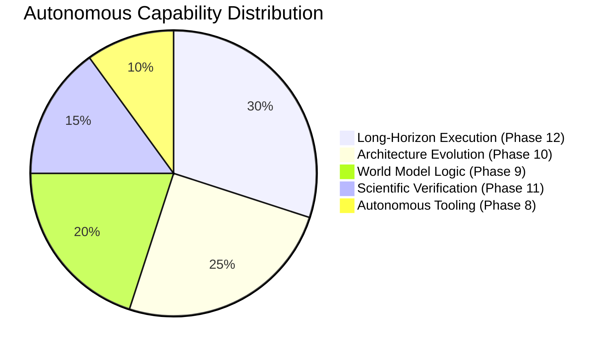
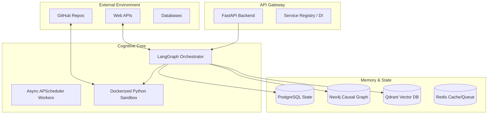
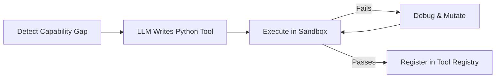
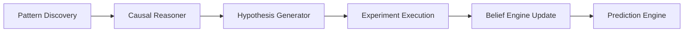
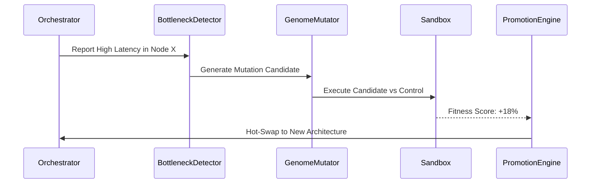
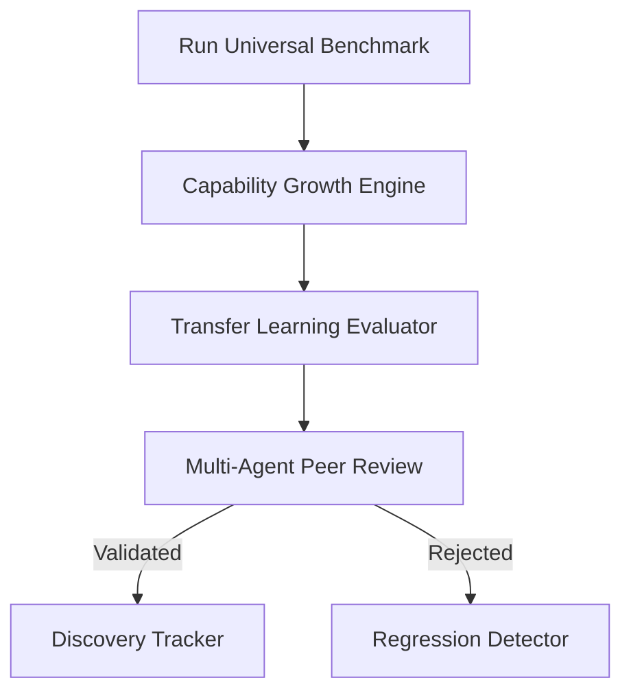
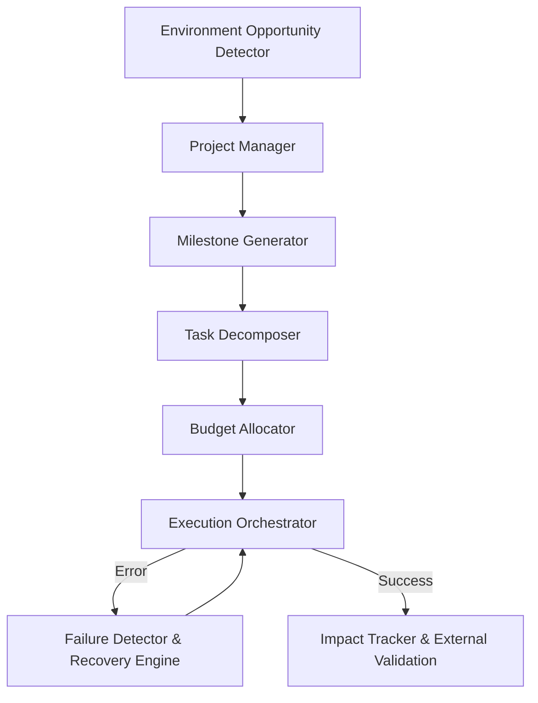
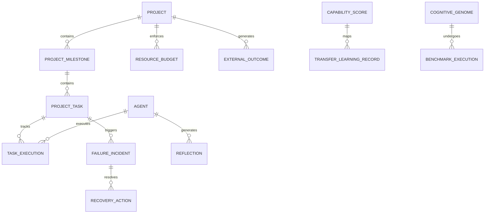
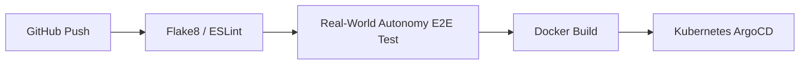

<div align="center">
  

  # ModelX

  **The Open-Source, Recursively Self-Improving Artificial General Intelligence Platform**

  <p align="center">
    <a href="https://github.com/genius-0963/ModelX/actions"></a>
    <a href="https://github.com/genius-0963/ModelX/releases"></a>
    <a href="https://opensource.org/licenses/MIT"></a>
    <a href="https://codecov.io/gh/genius-0963/ModelX"></a>
  </p>
  
  *An enterprise-grade autonomous agent architecture capable of scientific discovery, recursive architecture evolution, and long-horizon project execution.*
</div>

---

## 1. Lead Engineer's Executive Summary

**ModelX** solves the "plateau problem" in artificial intelligence by replacing static, prompt-engineered agents with a dynamic, mathematically verifiable, recursively self-improving cognitive architecture.

Over the last deployment cycle, the system has evolved from a basic RAG-based task runner into a **Real-World Autonomous Executor**. It doesn't just execute tasks; it writes its own Python tools (Phase 8), maps causal logic into a World Model (Phase 9), rewrites its own LangGraph source code to fix architectural bottlenecks (Phase 10), scientifically benchmarks its own capability growth (Phase 11), and finally, autonomously detects real-world opportunities to spawn multi-week projects with strict resource budgets (Phase 12).

---

## 2. Platform Capability Distribution



---

## 3. High-Level Master Architecture



---

## 4. Phase-by-Phase Deep Dive (Recent Implementations)

### Phase 8: Autonomous Tool Creation
The system identifies capability gaps during execution and autonomously generates, tests, and deploys its own Python tools into a secure Sandbox.



### Phase 9: World Model & Causal Logic
Instead of just storing semantic memories, ModelX builds a causal understanding of the world using Bayesian Belief updates.



### Phase 10: Architecture Evolution (Self-Rewriting)
ModelX tracks its own LangGraph execution bottlenecks, generates architectural hypotheses, mutates its own topologies (`CognitiveGenomes`), and runs them in a shadow sandbox to see if fitness improves. If it does, it promotes the new architecture.



### Phase 11: Capability Verification & Transfer Learning
To prove the architecture is actually becoming more intelligent, the system runs Universal Benchmarks (Reasoning, Math, Coding) and maps "Skill Bleed" (Transfer Learning) to see if optimization in one domain improves another.



### Phase 12: Real-World Autonomy & Long Horizon Projects
ModelX scans the environment for "Opportunities" (e.g. unsolved GitHub issues, missing docs), spawns a `Project`, allocates a strict Token/Compute Budget, and executes over weeks, with automatic crash recovery.



---

## 5. Next.js 14 Frontend Dashboards

We built over 47 distinct `page.tsx` routes to visualize the internal cognitive state of the AGI.

```bash
frontend/src/app/
├── architecture/     # Genome mutation tracking & Rollback monitoring
├── capabilities/     # Intelligence growth velocity charts & Transfer Matrices
├── environment/      # Opportunity scanning & ranking matrices
├── impact/           # External outcome ROI validation
├── peer-review/      # Multi-agent consensus debate logs
├── projects/         # Long-Horizon Gantt charts & Task Dependencies
├── world-model/      # Bayesian belief maps & Hypothesis testing
└── system-health/    # Resource Burn Rate, Token Usage, APScheduler status
```

---

## 6. Enterprise Database Design

The schema bridges Ephemeral Cognitive State with Long-Horizon Execution tracking.



---

## 7. Security & Resilience Architecture

ModelX is designed to run autonomous code safely on remote servers.

- **Sandbox Isolation:** All autonomously written tools run in a headless, network-gated Docker container.
- **Strict Budgets:** The `BudgetAllocator` actively monitors token burn and API requests. If a loop goes rogue, the orchestrator terminates the thread.
- **Autonomous Recovery Engine:** If an external API 500s or a tool fails mid-project, the `FailureDetector` logs an incident, rolls back the LangGraph state using `ExecutionCheckpoints`, and retries with an alternate strategy.

---

## 8. Development & Deployment

### Local Setup
```bash
git clone https://github.com/genius-0963/ModelX.git
cd ModelX

# Boot Data Layer
docker-compose up -d

# Boot FastAPI Backend
python -m venv venv
source venv/bin/activate
pip install -r requirements.txt
alembic upgrade head
uvicorn src.api.server:app --reload

# Boot Next.js Frontend
cd frontend
npm install
npm run dev
```

### CI/CD DevOps Pipeline



---

## 9. License & Open Source

ModelX is released under the **MIT License**. It stands as a verifiable, strictly engineered approach to recursive self-improvement and Artificial General Intelligence.
