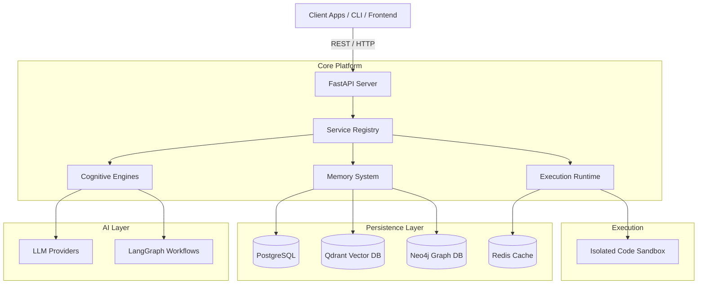

<div align="center">

# 🧠 ModelX

**Phase 1 AGI-Inspired Autonomous Agent Platform**

[](https://www.python.org/)
[](https://fastapi.tiangolo.com)
[](https://www.docker.com/)
[](https://opensource.org/licenses/MIT)

*An enterprise-grade operating system for cognitive agents featuring advanced memory, meta-learning, swarm intelligence, and execution sandboxing.*

[Documentation](docs/) | [API Reference](docs/api/) | [Roadmap](docs/analysis/16_improvement_roadmap.md)

</div>

---

## 🌟 Introduction

**ModelX** is an ambitious autonomous agent platform designed to push the boundaries of agentic AI. It provides a robust, highly modular operating system for orchestrating cognitive agents capable of planning, reflection, multi-tier memory management, tool execution, and self-improvement. 

Unlike standard LLM wrappers, ModelX implements a biological-inspired cognitive architecture driven by LangGraph, backed by polyglot persistence (PostgreSQL, Qdrant, Neo4j, Redis), and secured by isolated execution sandboxes.

## 🏗 Architecture Overview

ModelX employs a microservices-inspired internal architecture, decoupling cognitive reasoning from execution and persistence.



## ✨ Feature Highlights & AI Capability Matrix

| Capability | Status | Description |
|------------|--------|-------------|
| **Multi-Tier Memory** | 🟢 Active | Working, Short-Term, Long-Term, Semantic (Vector), and Episodic (Graph) memory. |
| **Cognitive Reflection** | 🟢 Active | Dedicated engines for Failure Analysis, Meta-Learning, and Self-Improvement. |
| **Sandboxed Execution** | 🟢 Active | Agents execute generated Python code securely in isolated Docker containers. |
| **Swarm Intelligence** | 🟡 Partial | Foundation for multi-agent coordination (`agent_society`) is implemented. |
| **Multimodal Vision** | 🟢 Active | Support for image processing and OCR via OpenAI/Anthropic/OpenCV integrations. |
| **MCP Integration** | 🔴 Planned | Model Context Protocol support is currently on the roadmap. |

## 🛠 Technology Stack

- **Frameworks:** FastAPI, LangChain, LangGraph
- **State & Checkpoints:** PostgreSQL (via `asyncpg`, SQLAlchemy, Alembic)
- **Vector Search & RAG:** Qdrant
- **Graph & Knowledge:** Neo4j
- **Caching & Rate Limiting:** Redis
- **Background Jobs:** APScheduler
- **Observability:** Prometheus, Grafana, Structlog

## 🚀 Quick Start (Under 5 Minutes)

### 1. Prerequisites
- Python 3.12+
- Docker & Docker Compose
- `uv` or `pip`

### 2. Installation & Configuration

Clone the repository and set up the environment:
```bash
git clone https://github.com/your-org/ModelX.git
cd ModelX

# Copy environment template
cp .env.example .env
```

Edit `.env` to add your preferred LLM API keys:
```ini
ANTHROPIC_API_KEY=sk-ant-...
OPENAI_API_KEY=sk-proj-...
```

### 3. Launch Services

Start the core infrastructure (PostgreSQL, Qdrant, Neo4j, Redis, Prometheus, Grafana) and the API server:
```bash
docker compose up -d
```

Check the health of the system:
```bash
curl http://localhost:8000/health
```

Access the API documentation at: [http://localhost:8000/docs](http://localhost:8000/docs)

## 📖 Usage Examples

### Python CLI
ModelX comes with a built-in CLI powered by Click:
```bash
uv run modelx agent start --goal "Research the latest advancements in quantum computing and write a report."
```

### REST API
Trigger a background task via the API:
```bash
curl -X POST "http://localhost:8000/api/v1/tasks" \
     -H "Authorization: Bearer <TOKEN>" \
     -H "Content-Type: application/json" \
     -d '{"description": "Analyze AAPL stock performance over the last 30 days."}'
```

## 🧩 Extension Guides

### Adding a New Tool
1. Subclass the `BaseTool` in `src/tools/base.py`.
2. Implement the `_run` method.
3. Register it with the central tool registry.

### LLM Providers
ModelX supports diverse providers out-of-the-box via LangChain integrations. Configure via `.env`:
- OpenAI, Anthropic, Gemini, DeepSeek, Qwen, Kimi, Local Models (Ollama)

### RAG & Memory
- Drop PDFs into the `/workspace` volume to trigger automatic ingestion (`src/rag/ingestion.py`).
- Memory consolidation runs automatically via the background `worker` service.

## 🔬 Testing & Monitoring
- **Tests:** Run `pytest tests/` to execute the comprehensive test suite (unit, integration, e2e, adversarial).
- **Monitoring:** Navigate to `http://localhost:3001` (Grafana) to view Prometheus metrics.

## 📂 Repository Structure

```text
ModelX/
├── src/                # Core platform logic
│   ├── api/            # FastAPI routes & middleware
│   ├── cognition/      # Meta-learning, reflection, & reasoning
│   ├── memory/         # Multi-tier memory fabric
│   ├── rag/            # Retrieval Augmented Generation
│   ├── tools/          # Agent actions & integrations
│   └── runtime/        # LangGraph execution loops
├── docs/               # Architecture reports & documentation
├── tests/              # Test suites
├── docker/             # Container configurations
└── alembic/            # Database migrations
```

## 🤝 Contributing
We welcome contributions! Please review our [Code Quality Assessment](docs/analysis/13_code_quality.md) and [Improvement Roadmap](docs/analysis/16_improvement_roadmap.md) before opening a PR.
1. Fork the repo.
2. Create a feature branch (`git checkout -b feature/amazing-feature`).
3. Ensure type checks and tests pass (`mypy --strict src` and `pytest`).
4. Submit a Pull Request.

## ⚠️ Known Limitations
- **MCP:** Standardized Model Context Protocol servers are not yet supported.
- **Context Bloat:** Long-running agents may exhaust token limits if memory pruning heuristics are bypassed.

## 📄 License
This project is licensed under the MIT License - see the LICENSE file for details.

## 🙏 Acknowledgements
Inspired by LangGraph, AutoGen, and the broader open-source AI community.
