# ModelX: Autonomous Agent Platform

[](https://www.python.org/downloads/)
[](https://opensource.org/licenses/MIT)
[](https://fastapi.tiangolo.com)
[](https://python.langchain.com/docs/langgraph)

> **ModelX** is a production-grade, AGI-inspired cognitive architecture designed to bridge the gap between reactive AI assistants and proactive, continuous-learning autonomous agents.

---

## 📖 Complete Documentation

# ModelX: AGI-Inspired Autonomous Agent Platform

## SECTION 1: EXECUTIVE SUMMARY

### Vision
ModelX aims to bridge the gap between reactive AI assistants and proactive, continuous-learning Autonomous General Intelligence (AGI). Our vision is an orchestration platform where AI agents do not merely execute user instructions but possess the capability to identify knowledge gaps, formulate their own long-term research goals, optimize their strategies iteratively through experience, and self-improve over time without human intervention.

### Objectives
1. **Autonomy over Automation**: Transition from prompting loops to fully autonomous operational cycles.
2. **Persistent Cognitive Memory**: Equip the system with long-term semantic, episodic, and procedural memory that mirrors human cognitive consolidation.
3. **Continuous Meta-Learning**: Build an architecture where the system learns *how to learn*, caching successful strategies and avoiding repeated failures.
4. **Scalability**: Deliver this cognitive architecture on top of robust, horizontally scalable infrastructure suitable for 50+ engineer teams and large deployments.

### Scope
ModelX is an orchestration platform rather than a standalone model. It relies on foundational LLMs (e.g., Claude, OpenAI) for raw reasoning, wrapped in a specialized cognitive architecture comprising multiple distinct agent personas managed by LangGraph. It includes memory subsystems, Vector/RAG infrastructure, meta-learning databases, and Neo4j-backed Knowledge Graphs.

### High-Level System Description
At its core, ModelX is an event-driven, multi-agent system built on FastAPI and LangGraph. An `OrchestratorAgent` routes complex tasks across specialized agents (`ResearchAgent`, `ExecutionAgent`, `MemoryAgent`, `ReflectionAgent`, etc.). The system records every interaction. Post-execution, the `LearningEngine` abstracts successes and failures into policies, while the `AutonomousResearchLoop` endlessly scans the knowledge base for gaps to construct long-horizon research plans independently.

### Key Capabilities
- **Multi-Agent Orchestration**: Decomposes complex goals and routes them to specialist agents.
- **RAG & Vector Memory**: High-speed semantic search over massive codebases and documentation via Qdrant.
- **Hierarchical Goal Generation**: Capable of producing and executing 100+ step deterministic plans.
- **Meta-Learning & Experience Replay**: Stores successful code executions and retrieves them for similar future tasks.
- **Knowledge Graph Integration**: Understands structural relationships, contradictions, and missing prerequisites via Neo4j.

### Competitive Advantages
1. **Self-Improvement Loop**: Most AI systems are static. ModelX updates its own operational policies via the `SelfImprovementAgent`.
2. **Deterministic Orchestration**: LangGraph provides explicit, transparent state machine control over agent workflows, preventing infinite hallucinations.
3. **Unified Memory Hierarchy**: Combines Redis (working memory), PostgreSQL (episodic memory), Qdrant (semantic memory), and Neo4j (structural memory) into a cohesive cognitive architecture.

---

## SECTION 2: SYSTEM OVERVIEW

The ModelX architecture is divided into three distinct strata: the Infrastructure Layer, the Intelligence Layer, and the Meta-Cognitive Layer.

### High-Level Architecture Explanation
1. **Infrastructure Layer**: Exposes REST endpoints via FastAPI. Data is persisted relationally in PostgreSQL (managed by Alembic), vectorially in Qdrant, graphically in Neo4j, and cached in Redis.
2. **Intelligence Layer**: Managed by LangGraph. When a user requests a goal, the Orchestrator instantiates a state machine. It decomposes tasks, recalls memory, executes actions, and returns results.
3. **Meta-Cognitive Layer**: Operates alongside and above the Intelligence Layer. It reflects on completed tasks, detects systemic knowledge gaps, dynamically ranks strategies based on past success rates, and autonomously generates new research portfolios to expand system capabilities.

### Component Responsibilities
- **API (FastAPI)**: Ingress for user requests and integration points for external webhooks.
- **PostgreSQL**: Source of truth for structured data (Users, Sessions, Task histories, Strategies, Goals).
- **Qdrant**: Source of truth for unstructured data embeddings (Documents, Raw Memories, Code snippets).
- **Neo4j**: Source of truth for topological relationship mappings (Concept A requires Concept B).
- **LangGraph**: Workflow engine that manages state transitions and prevents agents from deviating from established plans.

### System Boundaries
- ModelX relies on external LLM providers (Anthropic/OpenAI) for token generation.
- ModelX operates in isolated Docker environments to securely execute generated code.

### External Dependencies
- Anthropic API (Claude 3.5 Sonnet)
- OpenAI API (Embeddings)
- Docker Daemon (Sandboxed execution)

### Architecture Diagram

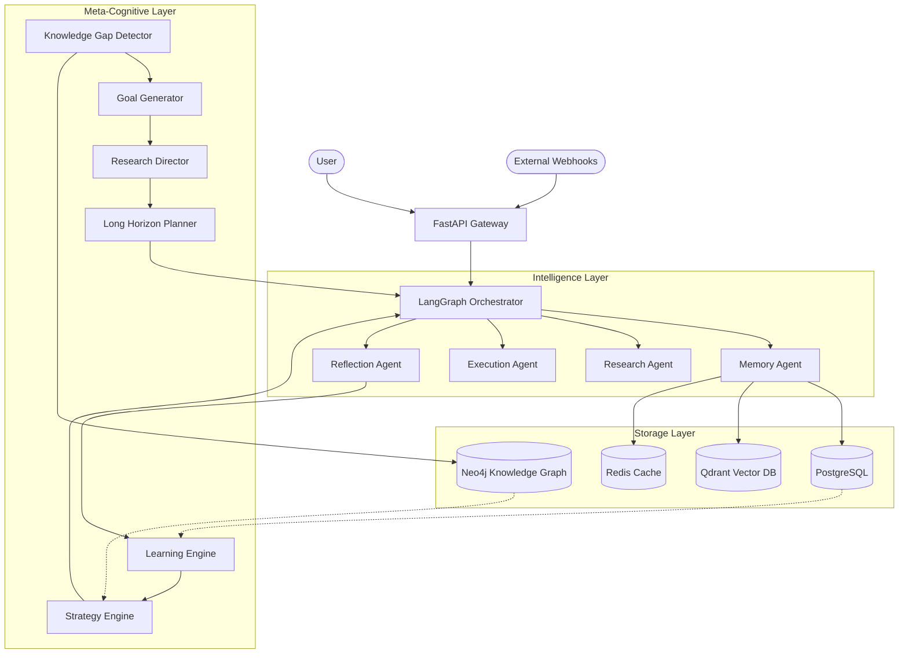

---

## SECTION 3: COMPLETE ARCHITECTURE

### 1. System Architecture
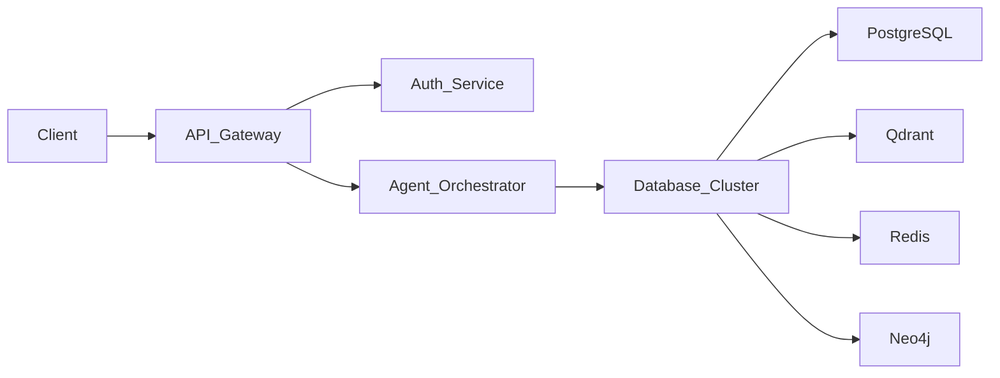

### 2. Agent Architecture
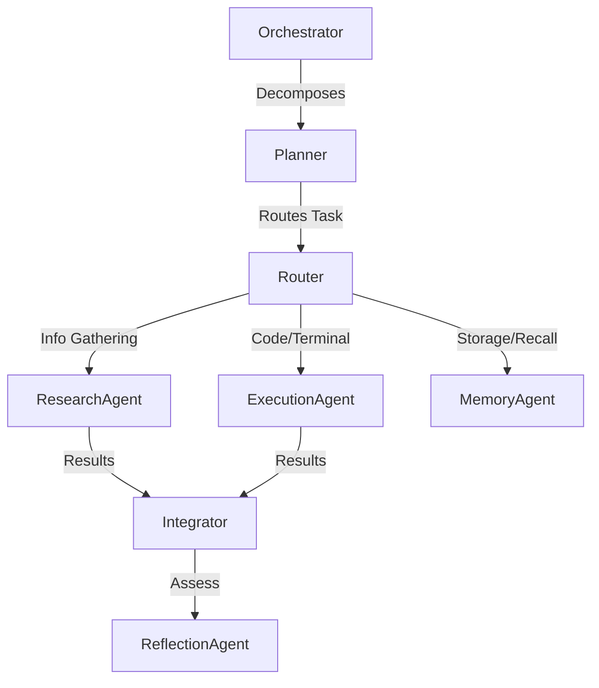

### 3. Memory Architecture
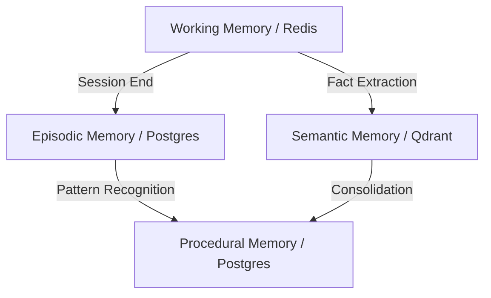

### 4. RAG Architecture
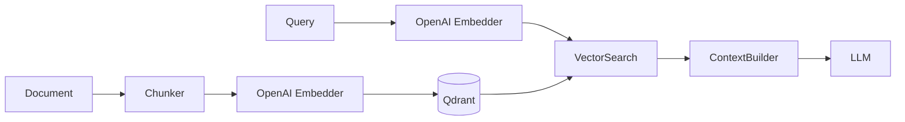

### 5. Knowledge Graph Architecture
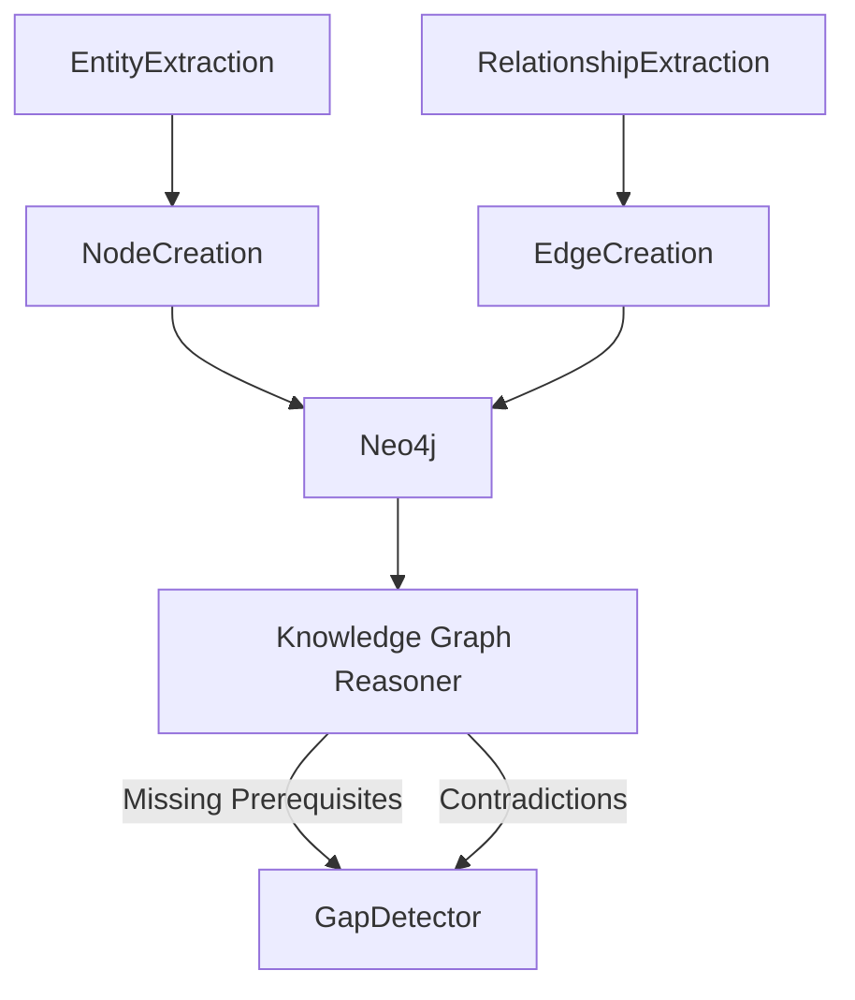

### 6. Learning Architecture
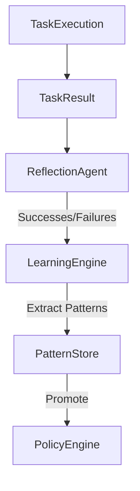

### 7. Meta-Learning Architecture
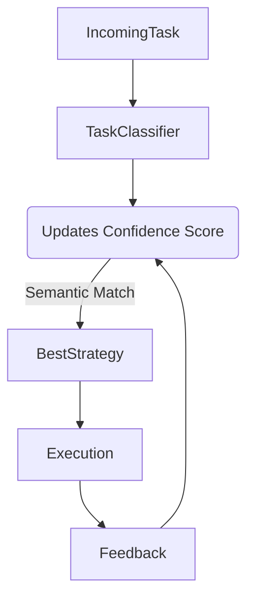

### 8. Autonomous Research Architecture
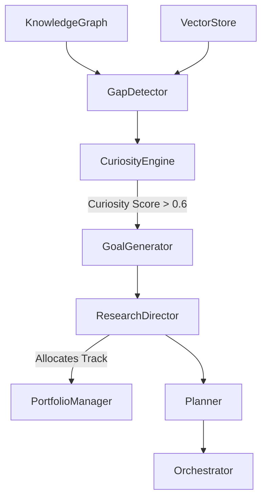

### 9. Infrastructure Architecture
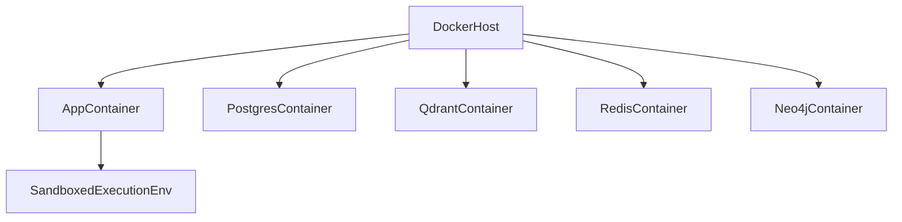

### 10. Deployment Architecture
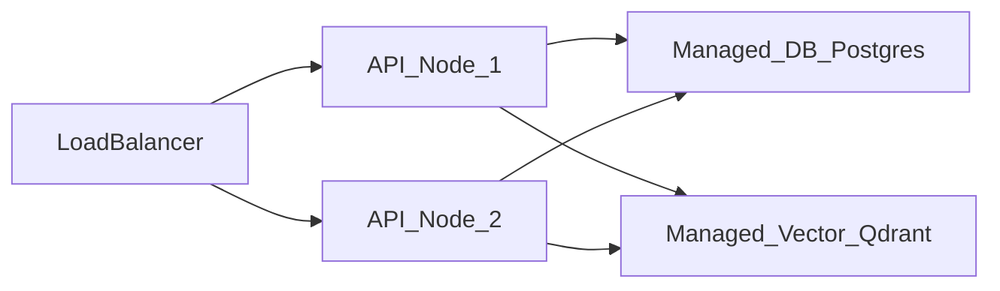

---

## SECTION 4: DIRECTORY STRUCTURE

The project is structured following Domain-Driven Design (DDD) principles and modern Python backend standards.

```text
ModelX/
├── alembic/                  # Database schema migrations
│   ├── env.py                # Alembic environment configuration
│   └── versions/             # Iterative SQL migration scripts
├── docs/                     # Project documentation (You are here)
├── src/                      # Core application source code
│   ├── agents/               # LangGraph agent definitions and states
│   │   ├── orchestrator.py   # Main LangGraph StateMachine
│   │   ├── state.py          # Shared AgentStateDict definition
│   │   ├── planner_v2.py     # Long-horizon 100+ step planner
│   │   ├── research_director.py # Autonomous track allocator
│   │   ├── goal_generator.py # Autonomous objective generator
│   │   └── autonomous_research_loop.py # Background autonomous loop
│   ├── api/                  # FastAPI web server layer
│   │   ├── dependencies.py   # FastAPI dependency injection (DB, Agents)
│   │   ├── main.py           # Application entry point and router mounting
│   │   ├── middleware.py     # CORS, Logging, Error handling
│   │   ├── routes/           # REST endpoint definitions by domain
│   │   └── schemas/          # Pydantic input/output validation models
│   ├── config/               # System configuration
│   │   ├── settings.py       # Pydantic BaseSettings (env vars)
│   │   └── logging.py        # Structured JSON logger setup
│   ├── db/                   # Relational database layer (PostgreSQL)
│   │   ├── database.py       # Async SQLAlchemy session management
│   │   ├── enums.py          # Postgres ENUM types
│   │   ├── models.py         # SQLAlchemy ORM declarations
│   │   └── repositories/     # Repository pattern data access classes
│   ├── knowledge_graph/      # Topological memory layer (Neo4j)
│   │   ├── client.py         # Async Neo4j driver wrapper
│   │   ├── manager.py        # Entity/Concept node insertion logic
│   │   └── reasoning.py      # Cypher queries for gap/contradiction detection
│   ├── memory/               # Episodic and working memory subsystems
│   │   └── long_term.py      # Persistence interfaces for memory
│   ├── meta/                 # Meta-learning and reflection subsystems
│   │   ├── curiosity_engine.py # Evaluates gaps to calculate scores
│   │   ├── experience_replay.py # Caches past execution traces
│   │   ├── goal_tree.py      # Hierarchical dependency tracking
│   │   ├── knowledge_gap_detector.py # Finds weak spots in system knowledge
│   │   ├── learning_engine.py # Abstracts lessons from reflections
│   │   ├── portfolio_manager.py # Manages high-level research tracks
│   │   ├── skill_library.py  # Repository of reusable procedural code
│   │   ├── strategy_engine.py # Ranks execution strategies
│   │   └── task_classifier.py # Categorizes tasks semantically
│   └── rag/                  # Semantic memory layer (Qdrant)
│       ├── vector_store.py   # Qdrant client wrapper and collection manager
│       └── document_parser.py # Text extraction and chunking
├── tests/                    # Test suite (pytest)
│   ├── unit/                 # Isolated component tests
│   ├── integration/          # Database and API integration tests
│   └── e2e/                  # End-to-end multi-agent flow tests
├── docker-compose.yml        # Local infrastructure orchestration
├── pyproject.toml            # Python dependencies and build config
└── README.md                 # Primary project entrypoint
```

### Directory Responsibilities
- **`src/agents/`**: Contains the core intelligence of the system. Relies heavily on LangChain and LangGraph.
- **`src/api/`**: Strictly handles HTTP transport, validation, and serialization. Does not contain business logic.
- **`src/db/`**: Handles all structured data persistence. Uses the Repository pattern to decouple ORMs from business logic.
- **`src/meta/`**: Houses all Phase 5 and Phase 6 cognitive upgrades that allow the system to self-optimize and explore autonomously.


## SECTION 5: DATABASE DOCUMENTATION

ModelX relies heavily on PostgreSQL for structured relational data. The database schema is designed to track long-term execution histories, hierarchical goals, and meta-learning configurations.

### Entity-Relationship Diagram

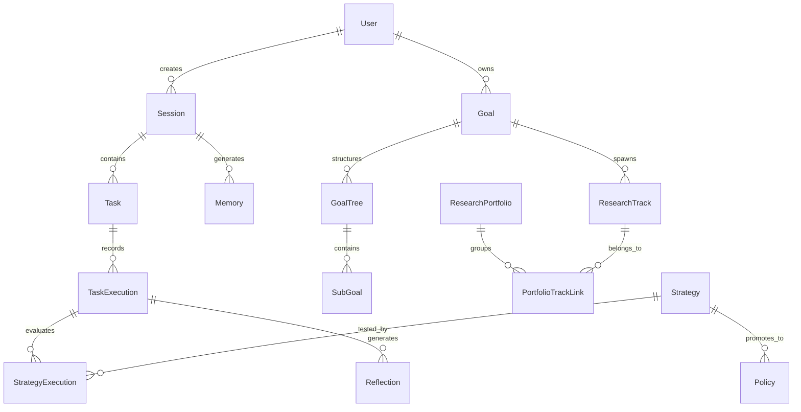

### Table Definitions

#### 1. Users & Sessions
- **`users`**: Purpose: Identity tracking.
  - Columns: `id` (UUID, PK), `email` (String, Unique), `hashed_password` (String), `is_active` (Boolean).
- **`sessions`**: Purpose: Group tasks and agent interactions by time boundary.
  - Columns: `id` (UUID, PK), `user_id` (UUID, FK), `title` (String), `status` (Enum).

#### 2. Execution & History
- **`tasks`**: Purpose: Decomposed individual actions.
  - Columns: `id`, `session_id`, `description`, `agent_type`, `status`.
- **`task_executions`**: Purpose: Immutable ledger of execution attempts.
  - Columns: `id`, `task_id`, `output`, `error_message`, `tokens_used`, `duration_ms`.

#### 3. Meta-Learning
- **`strategies`**: Purpose: Reusable approaches for solving specific task types.
  - Columns: `id`, `name`, `description`, `task_type` (Enum), `confidence_score` (Float).
- **`strategy_executions`**: Purpose: Linking strategies to actual task attempts to track success rates.
  - Columns: `id`, `strategy_id`, `task_execution_id`, `success` (Boolean), `feedback` (String).
- **`policies`**: Purpose: Automated rules promoted from highly successful strategies.
  - Columns: `id`, `strategy_id`, `rule_definition` (JSON).
- **`skills`**: Purpose: Stored procedural code snippets.
  - Columns: `id`, `name`, `code_content`, `validation_status` (Enum).

#### 4. Autonomous Research
- **`knowledge_gaps`**: Purpose: Tracking areas where the system lacks information.
  - Columns: `id`, `domain`, `description`, `importance`, `confidence`.
- **`generated_goals`**: Purpose: Objectives autonomously derived from gaps.
  - Columns: `id`, `gap_id`, `title`, `curiosity_score`, `status`.
- **`goal_trees`** & **`sub_goals`**: Purpose: 100+ step hierarchical plans.
  - Columns: `tree_id`, `parent_id`, `dependencies` (Array).
- **`research_tracks`**: Purpose: Active continuous investigations.
  - Columns: `id`, `goal_id`, `progress_percentage`, `status`.
- **`research_portfolios`**: Purpose: Broad groupings of tracks.
  - Columns: `id`, `name`, `overall_progress`.

---

## SECTION 6: AGENT DOCUMENTATION

ModelX uses a multi-agent system where distinct personas handle different responsibilities. They are orchestrated by LangGraph.

### 1. OrchestratorAgent
- **Purpose**: The central nervous system of ModelX.
- **Responsibilities**: Analyzes user goals, decomposes them into tasks, routes tasks to specialists, evaluates integration of results, and triggers reflection loops.
- **Inputs**: User Prompt, AgentStateDict.
- **Outputs**: Fully populated AgentStateDict, Final Execution Report.
- **Workflow**: Goal Analysis -> Decompose Tasks -> Classify Task -> Route -> Integrate -> Replan -> Reflect.

### 2. ResearchAgent
- **Purpose**: Information gathering and synthesis.
- **Responsibilities**: Formulates search queries, interfaces with web APIs (e.g., Tavily), reads documentation, and synthesizes findings.
- **Inputs**: Task Description, Search APIs.
- **Outputs**: Structured Research Report.
- **Dependencies**: RAG Vector Store, External APIs.

### 3. ExecutionAgent
- **Purpose**: Performing actions that alter the world state.
- **Responsibilities**: Writes code, executes bash commands, modifies files, interacts with REST APIs.
- **Inputs**: Strategy context, Task instructions, Code environment.
- **Outputs**: Command outputs, Error traces.
- **Dependencies**: Docker Sandboxing.

### 4. MemoryAgent
- **Purpose**: Cognitive persistence.
- **Responsibilities**: Stores and recalls information from PostgreSQL (Episodic) and Qdrant (Semantic).
- **Inputs**: Context strings, User queries.
- **Outputs**: Retrieved MemoryRecords, KnowledgeChunks.

### 5. ReflectionAgent
- **Purpose**: Self-correction and evaluation.
- **Responsibilities**: Reviews a completed session, identifies what went right and wrong, and isolates root causes of failures.
- **Inputs**: Task Execution Traces.
- **Outputs**: ReflectionOutput (Successes, Failures, Root Causes).

### 6. StrategyAgent
- **Purpose**: Adaptive planning.
- **Responsibilities**: Suggests novel ways to approach a task if standard methods fail by synthesizing existing skills and baseline strategies.
- **Outputs**: Dynamic Strategy JSON.

### 7. SelfImprovementAgent
- **Purpose**: System-wide optimization.
- **Responsibilities**: Periodically reviews aggregate metrics (latency, token usage, success rates) and modifies internal system prompts and automated policies.
- **Workflow**: Runs asynchronously as a background cron job.

### 8. GoalGenerator
- **Purpose**: Proactive objective setting.
- **Responsibilities**: Reviews Knowledge Gaps identified by the system and uses LLMs to generate actionable goals to close those gaps.
- **Inputs**: KnowledgeGap, CuriosityScore.
- **Outputs**: GeneratedGoal record.

### 9. ResearchDirector
- **Purpose**: Investigation management.
- **Responsibilities**: Evaluates generated goals. If the curiosity score passes the threshold, it allocates a new `ResearchTrack` and initiates planning.
- **Dependencies**: GoalGenerator, LongHorizonPlanner.

### 10. PortfolioManager
- **Purpose**: High-level organization.
- **Responsibilities**: Groups multiple Research Tracks into cohesive domains (e.g., "Memory Architecture Optimization") and tracks aggregate progress.


## SECTION 7: MEMORY SYSTEM DOCUMENTATION

ModelX features a multi-tiered memory architecture inspired by human cognition. Rather than treating memory as a simple database query, the system shifts information across layers based on relevance, decay, and reinforcement.

### Memory Tiers

#### 1. Short-Term Memory (Redis)
- **Concept**: Represents the "Working Memory" or context window of an active session.
- **Function**: Temporarily holds variable states, recent agent messages, and intermediate calculation results.
- **Eviction**: Cleared or persisted when a session terminates.

#### 2. Episodic Memory (PostgreSQL)
- **Concept**: Autobiographical ledger of events.
- **Function**: Stores a chronological history of what the agent did. Maps `Task` -> `TaskExecution` -> `Outputs`.
- **Use Case**: Post-execution reflection and debugging. "What did I do last Tuesday when trying to deploy the web app?"

#### 3. Semantic Memory (Qdrant)
- **Concept**: Abstracted, general knowledge separated from the time it was learned.
- **Function**: Embeds documents, facts, and abstracted rules into vectors for fast semantic similarity search.

#### 4. Procedural Memory (PostgreSQL/Meta-Layer)
- **Concept**: Memory of *how* to do things.
- **Function**: Consists of `Strategies`, `Policies`, and executable `Skills`. Triggered implicitly based on task classification rather than explicit factual lookup.

### Memory Workflows

#### Experience Replay Workflow
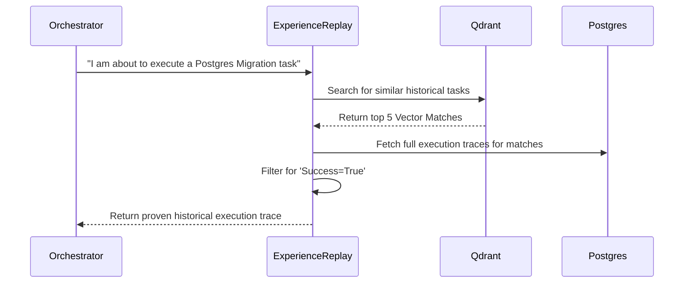

#### Memory Consolidation
The `MemoryConsolidator` periodically scans raw Episodic Memories. If it detects multiple memories about "Docker build failures", it uses an LLM to abstract a single generalized rule: "Always ensure multi-stage Dockerfiles copy the compiled binary to the final scratch image." This rule is then embedded into Semantic Memory, and the raw episodic traces can be compressed.

---

## SECTION 8: RAG DOCUMENTATION

Retrieval-Augmented Generation (RAG) forms the basis of the system's external knowledge ingestion and retrieval process.

### Components

1. **Document Ingestion API**: Endpoint to upload raw files (PDF, Markdown, HTML, source code).
2. **Chunking Engine**: Uses recursive character text splitters to divide documents into semantically coherent overlapping chunks (typically 1000 tokens with 200 overlap).
3. **Embedder**: Interfaces with `text-embedding-3-large` via the OpenAI API to convert chunks into 3072-dimensional floating-point vectors.
4. **VectorDB (Qdrant)**: Stores vectors and metadata (source URI, timestamps, domain tags).

### RAG Workflow

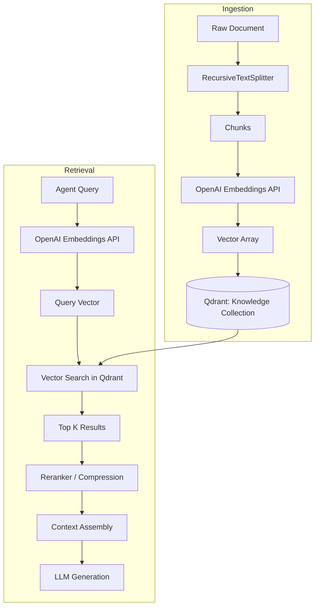

### Advanced RAG Techniques Used
- **Metadata Filtering**: Searches can be restricted to specific domains (e.g., `domain: 'python_dev'`) to increase precision.
- **Context Compression**: The raw top-K results are passed through a secondary LLM filter to extract only the sentences strictly relevant to the query before injecting them into the main agent's prompt, saving context window space.


## SECTION 9: META-LEARNING DOCUMENTATION

The Meta-Learning subsystem transforms ModelX from a static pipeline into an adaptive cognitive architecture. It observes the agent's successes and failures and updates the operational parameters of the system over time.

### Key Components

#### Reflection
After every task execution sequence, the `ReflectionAgent` evaluates the traces. It compares the initial `Goal` against the actual `Outputs` and generates a structured critique identifying root causes of failure (e.g., "Dependency missing", "Syntax error", "Hallucinated API endpoint").

#### Learning Engine
Ingests reflections. If a root cause appears repeatedly (e.g., 3 failures due to missing environment variables), the `LearningEngine` abstracts this into a `LearningPattern`. 

#### Strategy Engine
When a task is classified by the `TaskClassifier` (e.g., as `code_refactor`), the `StrategyEngine` queries the database for `Strategies` tied to that task type. It ranks them by `confidence_score` (calculated as successful executions / total executions). The Orchestrator applies the highest-ranked strategy. If it fails, the score decreases. Over time, poor strategies fall out of rotation.

### Meta-Learning Workflow
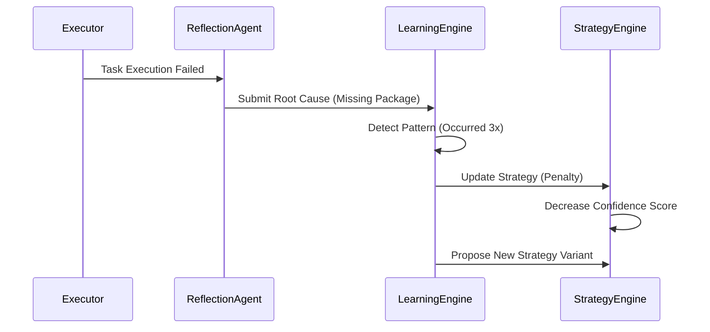

---

## SECTION 10: AUTONOMOUS RESEARCH SYSTEM

This system allows ModelX to proactively construct its own goals without user input, effectively allowing it to research, code, and learn indefinitely in the background.

### Mechanisms

1. **Knowledge Gap Detection**: The `KnowledgeGraphReasoner` periodically queries Neo4j for nodes with a `CONTRADICTS` relationship, or nodes marked as `REQUIRES` but missing in the database.
2. **Curiosity Engine**: Evaluates the detected gaps using a heuristic: `Score = (Novelty + Uncertainty + Impact + Importance) / 4`. 
3. **Goal Generation**: Gaps with a Curiosity Score > 0.6 are passed to the `GoalGenerator` LLM to formulate an actionable research objective.
4. **Research Director**: Groups generated goals into long-term `ResearchPortfolios` and initializes a `ResearchTrack`.
5. **Long Horizon Planner**: Decomposes the high-level goal into a hierarchical tree of up to 100+ deterministic subgoals (`GoalTree`).

### Autonomous Workflow
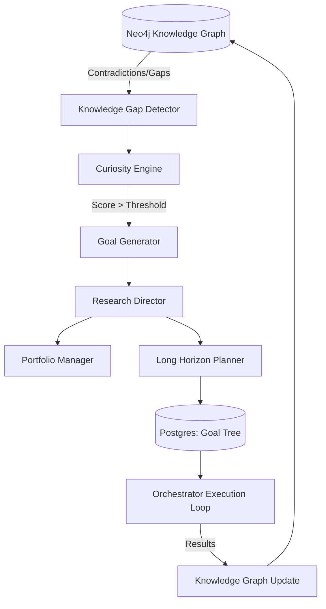

---

## SECTION 11: LANGGRAPH STATE MACHINE

LangGraph enforces deterministic control flow over the LLM agents. The `AgentStateDict` is passed sequentially from node to node.

### Complete StateGraph Flow

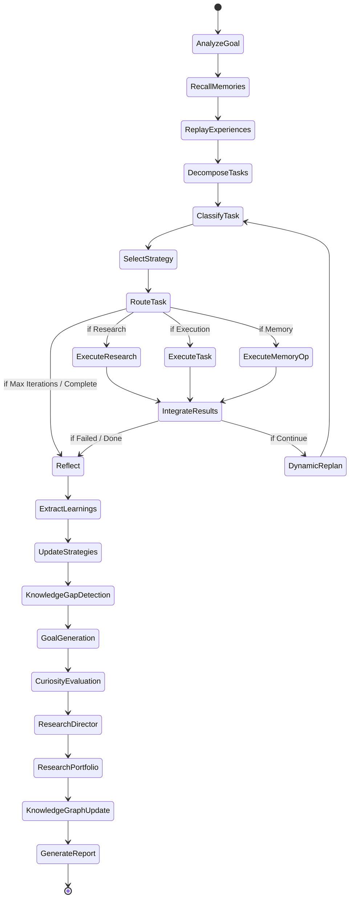

### State Management
The graph relies on the `AgentStateDict`, a `TypedDict` containing all transient state:
- `task_plan`: List of tasks to execute.
- `current_task_index`: Pointer to current task.
- `task_results`: Dictionary accumulating outputs.
- `errors`: List of failures.
- `iteration_count`: Incremented per loop to prevent infinite loops (hard stop at `max_iterations`).


## SECTION 12: API DOCUMENTATION

ModelX provides a RESTful API powered by FastAPI.

### Authentication
All protected endpoints require a Bearer token in the `Authorization` header (`Authorization: Bearer <token>`). Tokens are JWTs signed with `HS256`.

### Core Endpoints

#### 1. Goals API (`/api/v1/goals`)

| Method | Endpoint | Description | Request | Response | Status Codes |
|---|---|---|---|---|---|
| POST | `/` | Submit a new user goal | `{"title": "...", "description": "..."}` | `GoalResponse` | 201 Created, 400 Bad Request |
| GET | `/{goal_id}` | Get goal status | None | `GoalResponse` | 200 OK, 404 Not Found |
| POST | `/{goal_id}/execute` | Trigger Orchestrator | `{"max_iterations": 20}` | `ExecutionResult` | 202 Accepted |

#### 2. Tasks API (`/api/v1/tasks`)

| Method | Endpoint | Description | Request | Response | Status Codes |
|---|---|---|---|---|---|
| GET | `/{task_id}` | Retrieve specific task detail | None | `TaskResponse` | 200 OK |
| PATCH | `/{task_id}/status`| Update task status | `{"status": "completed"}` | `TaskResponse` | 200 OK |

#### 3. Memory API (`/api/v1/memory`)

| Method | Endpoint | Description | Request | Response | Status Codes |
|---|---|---|---|---|---|
| POST | `/store` | Store an episodic memory | `{"content": "...", "type": "episodic"}` | `MemoryResponse` | 201 Created |
| GET | `/recall` | Search memory (RAG) | `?q=query&limit=5` | `list[MemoryResponse]` | 200 OK |

#### 4. Meta-Learning API (`/api/v1/meta`)

| Method | Endpoint | Description | Request | Response | Status Codes |
|---|---|---|---|---|---|
| GET | `/strategies` | List execution strategies | `?task_type=coding` | `list[StrategyResponse]` | 200 OK |
| GET | `/skills` | List stored procedural skills | None | `list[SkillResponse]` | 200 OK |

#### 5. Autonomous Research API (`/api/v1/autonomous`)

| Method | Endpoint | Description | Request | Response | Status Codes |
|---|---|---|---|---|---|
| GET | `/gaps` | List detected knowledge gaps | None | `list[KnowledgeGapResponse]` | 200 OK |
| POST | `/goals/generate` | Trigger autonomous generation | `{"limit": 5}` | `{"message": "..."}` | 202 Accepted |
| GET | `/portfolios` | View active research portfolios | None | `list[PortfolioResponse]` | 200 OK |

---

## SECTION 13: WORKFLOW DOCUMENTATION

### Workflow 1: User Goal Execution

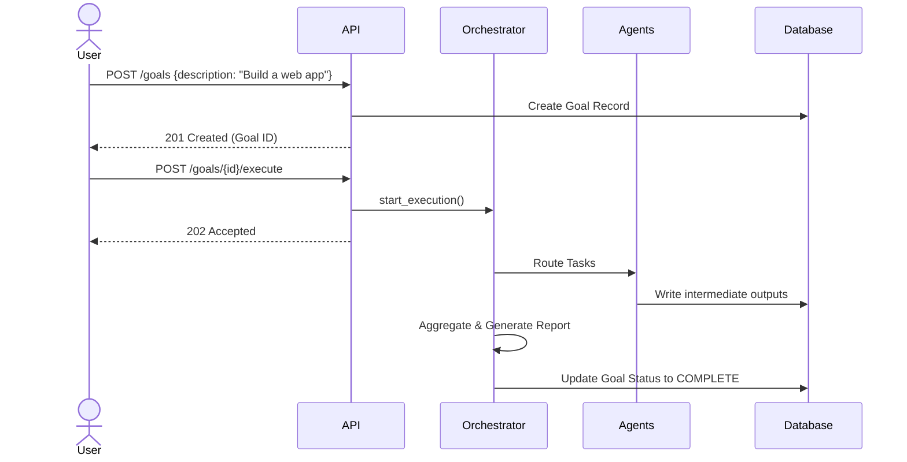

### Workflow 2: Memory Recall

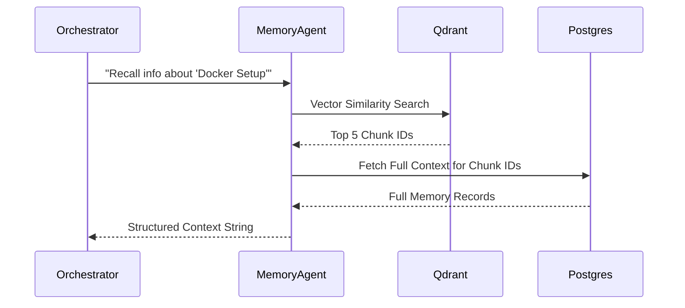

### Workflow 3: Failure Recovery (Self-Healing)

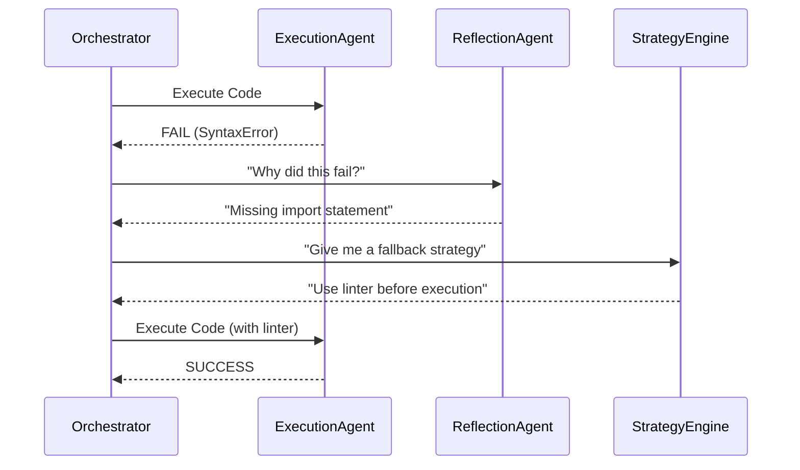


## SECTION 14: DEPLOYMENT GUIDE

ModelX is containerized for seamless deployment from local environments to production Kubernetes clusters.

### Local Setup
1. Clone the repository.
2. Copy `.env.example` to `.env` and fill in `ANTHROPIC_API_KEY` and `OPENAI_API_KEY`.
3. Run `docker-compose up -d --build`.
   - This spins up PostgreSQL (5432), Qdrant (6333), Redis (6379), Neo4j (7687), and the FastAPI application (8000).

### Production Setup
For production, avoid `docker-compose`. Use Managed Services:
- **Database**: AWS RDS (PostgreSQL) or Google Cloud SQL.
- **Cache**: AWS ElastiCache (Redis).
- **Vector DB**: Qdrant Cloud cluster.
- **Knowledge Graph**: Neo4j AuraDB.
- **Compute**: AWS ECS (Fargate) or Kubernetes (EKS/GKE).

### Scaling
- **API Nodes**: FastAPI is stateless. Deploy behind an Application Load Balancer (ALB) and autoscale based on CPU utilization.
- **Agent Nodes**: LangGraph execution can be decoupled from the API using Celery or an SQS queue if synchronous wait times exceed API timeouts.
- **Database**: Use read-replicas for heavy analytic workloads (Reflection/Learning Engine).

### Disaster Recovery
- PostgreSQL: Daily automated snapshots with Point-in-Time Recovery (PITR) enabled.
- Qdrant: Can be entirely reconstructed from PostgreSQL (Episodes) and Neo4j (Concepts) if vector data is lost.
- Neo4j: Daily backups to S3.

---

## SECTION 15: OBSERVABILITY

ModelX generates massive amounts of asynchronous data. Strong observability is required.

### Logging
- **Format**: JSON structured logging via `structlog` in production, human-readable console output in development.
- **Levels**: `DEBUG` (LLM prompts/responses), `INFO` (State transitions), `WARNING` (Recoverable agent failures), `ERROR` (System crashes).

### Tracing
- Uses OpenTelemetry to trace requests across the API, LangGraph orchestration, LLM calls, and database transactions. 
- Integrates with Jaeger or Datadog.

### Metrics
- **Token Usage**: Tracked per agent, per session, per user. Critical for cost management.
- **Latency**: Measured for LLM generation vs. DB I/O vs. Agent Reasoning.
- **Success Rate**: The `PerformanceMonitor` tracks how often tasks succeed vs. fail, feeding directly into the Meta-Learning `StrategyEngine`.

---

## SECTION 16: SECURITY DOCUMENTATION

Given that ModelX generates and executes code, security is paramount.

### Authentication & Authorization
- Standard JWT-based Auth for API access.
- Role-Based Access Control (RBAC): Users can only access `Goals` and `Sessions` tied to their `user_id`.

### Code Execution Sandboxing
- **CRITICAL**: The `ExecutionAgent` MUST NOT run code on the host machine.
- All code generated by the agent is written to a temporary volume and executed inside an ephemeral, network-isolated Docker container (`python:3.11-slim`).
- Maximum execution time is strictly enforced (e.g., 300 seconds) to prevent infinite loops or cryptomining.

### Secrets Management
- LLM API keys (Anthropic, OpenAI) are injected via Environment Variables and never stored in the database.
- Agent-generated secrets (e.g., fake DB passwords created during testing) are tracked by the `MemoryAgent` but isolated from core system credentials.

### Threat Model
1. **Prompt Injection**: Mitigated by structured LangChain Prompts and validation using `pydantic` output parsers.
2. **Arbitrary Code Execution (ACE)**: The system *is designed* to execute arbitrary code. The threat is lateral movement. Mitigated via strict Docker isolation.
3. **Data Exfiltration**: The sandboxed container has egress access disabled unless the specific task requires web access (which is brokered through the `ResearchAgent` API instead).


## SECTION 17: DEVELOPER GUIDE

### Environment Setup
1. **Python**: Require Python 3.11+.
2. **Virtual Env**: `python -m venv venv && source venv/bin/activate`
3. **Dependencies**: `pip install -e .[dev]` (Installs pytest, black, mypy).
4. **Infrastructure**: `docker-compose up -d postgres qdrant redis neo4j`
5. **Migrations**: `alembic upgrade head`

### Adding a New Agent
1. Create `src/agents/new_agent.py`.
2. Define the prompt and input/output Pydantic schemas.
3. Import the agent into `src/agents/orchestrator.py`.
4. Update `AgentStateDict` in `src/agents/state.py` if the agent introduces new state variables.
5. Add a node in `_build_graph()` and map the conditional edges.

### Adding New Memory Types
If you need a new memory classification (e.g., "Visual Memory"):
1. Update Postgres Enums in `src/db/enums.py`.
2. Run `alembic revision --autogenerate -m "Add visual memory"`.
3. Update `MemoryAgent` to route logic appropriately.

---

## SECTION 18: TESTING DOCUMENTATION

ModelX uses `pytest` for all verification.

### Testing Strategy

#### 1. Unit Tests (`tests/unit/`)
- **Scope**: Individual functions, Pydantic validations, Utility classes.
- **Mocking**: All LLM calls and Database I/O must be mocked using `unittest.mock`.
- **Goal**: Fast feedback loop (runs in < 2 seconds).

#### 2. Integration Tests (`tests/integration/`)
- **Scope**: API endpoints, Database Repositories, Qdrant ingestion.
- **Mocking**: LLM calls are mocked. Databases are real (using a `test_db` instance spun up in Docker).
- **Goal**: Ensure schemas and network layers map correctly.

#### 3. E2E Tests (`tests/e2e/`)
- **Scope**: Full LangGraph execution from Goal -> Output.
- **Mocking**: None. Real LLMs and Real DBs are used.
- **Cost Warning**: E2E tests consume actual Anthropic/OpenAI tokens. Run only before merges to `main`.

### Coverage Goals
- Standard: 85%+ branch coverage.
- Excluded from coverage: `alembic/versions/` and generic interfaces.

---

## SECTION 19: PERFORMANCE DOCUMENTATION

ModelX performance is bottlenecked primarily by network I/O (LLM APIs) and context window limitations.

### Targets
- **API Latency**: < 200ms for non-execution endpoints (e.g., getting task status).
- **Orchestration Loop**: ~1-3 seconds per LangGraph node transition.
- **Task Execution**: Highly variable (5 seconds to 5 minutes depending on code execution or research depth).

### Token Usage & Constraints
- Anthropic Claude 3.5 Sonnet supports 200k tokens, but performance degrades above 100k.
- **Target**: Keep `AgentStateDict` message history under 30k tokens.
- **Mechanism**: The `MemoryConsolidator` aggregates old messages into summaries, and LangGraph is configured to pop old raw messages from the state array once they exceed the threshold.

### Resource Requirements
- **PostgreSQL**: 2 CPU, 4GB RAM minimum.
- **Qdrant**: 4 CPU, 16GB RAM recommended for production (vector search is memory intensive).
- **Neo4j**: 2 CPU, 4GB RAM.
- **FastAPI Workers**: 1 CPU, 1GB RAM per worker (I/O bound, not CPU bound).


## SECTION 20: FUTURE ROADMAP

ModelX is continuously evolving towards full AGI-like capabilities. 

### Phase 1: Core Infrastructure (Complete)
- Basic LangGraph Orchestration.
- FastAPI REST Interface.
- Sandboxed execution environments.

### Phase 2: Memory Systems (Complete)
- PostgreSQL for Episodic Memory.
- Redis for Short-Term Working Memory.

### Phase 3: Semantic Integration (Complete)
- Qdrant Vector Store integration.
- Retrieval-Augmented Generation (RAG) for internal agent queries.

### Phase 4: Reflection & Self-Correction (Complete)
- Post-execution reflection agent.
- Root cause analysis and retry loops.

### Phase 5: Meta-Learning & Strategy Optimization (Complete)
- `StrategyEngine` caches and ranks execution paths.
- `LearningEngine` abstracts successes into generalized rules.
- `PerformanceMonitor` tracks agent efficiency.

### Phase 6: Autonomous Goal Generation (Complete)
- Neo4j Knowledge Graph integration.
- `CuriosityEngine` and `KnowledgeGapDetector`.
- Unprompted background autonomous research cycles.

### Phase 7: Multi-Modal Context (Planned)
- Integrating vision models to allow agents to process UI screenshots during Web Execution tasks.
- **Expected Outcome**: Capability to autonomously test and interact with visual web applications.

### Phase 8: Swarm Orchestration (Planned)
- Expanding the single Orchestrator into a hierarchical Swarm architecture (Director Agents managing sub-Orchestrator Agents).
- **Expected Outcome**: Ability to tackle large-scale goals (e.g., "Build an entire SaaS platform") by distributing tasks across 50+ parallel agent instances.

### Phase 9: Real-Time Environment Adaptation (Planned)
- Agents can modify their own LangGraph topology dynamically at runtime based on shifting environment constraints.
- **Expected Outcome**: True autonomous resilience in hostile or rapidly changing operational environments.

### Phase 10: Human-AI Symbiosis (Planned)
- Fluid hand-off where the agent identifies specific ethical or creative roadblocks and integrates human feedback natively into the Goal Tree.

---

## SECTION 21: APPENDICES

### Glossary
- **AGI**: Artificial General Intelligence.
- **LangGraph**: State machine orchestration library built on LangChain.
- **RAG**: Retrieval-Augmented Generation.
- **Qdrant**: High-performance vector database.
- **Neo4j**: Graph database utilizing Cypher queries.
- **Cypher**: Query language used to map relationships in Neo4j.

### Architecture Decisions (ADRs)
1. **PostgreSQL over MongoDB**: Chose relational storage for episodic memory due to strict schema requirements for meta-learning strategy tracking.
2. **Docker over Lambda**: Sandboxing requires arbitrary long-running container instances (up to 5 mins); serverless environments presented restrictive timeouts.
3. **LangGraph over AutoGPT**: Hard requirement for deterministic state loops. Free-form agents hallucinate infinite loops; LangGraph's strict StateGraph prevents this.

### Coding Standards
- PEP 8 compliant via `black` and `ruff`.
- Strictly typed via `mypy` (`--strict` enabled).
- Pydantic v2 used universally for data validation.

### Reference Materials
- [LangGraph Documentation](https://python.langchain.com/docs/langgraph/)
- [Qdrant Vector Search](https://qdrant.tech/)
- [Neo4j Cypher Manual](https://neo4j.com/docs/cypher-manual/current/)


