# ModelX: AGI-Inspired Autonomous Agent Platform

## SECTION 1: EXECUTIVE SUMMARY

### Vision
ModelX aims to bridge the gap between reactive AI assistants and proactive, continuous-learning Autonomous General Intelligence (AGI). Our vision is an orchestration platform where AI agents do not merely execute user instructions but possess the capability to identify knowledge gaps, formulate their own long-term research goals, optimize their strategies iteratively through experience, and self-improve over time without human intervention.

### Objectives
1. **Autonomy over Automation**: Transition from prompting loops to fully autonomous operational cycles.
2. **Persistent Cognitive Memory**: Equip the system with long-term semantic, episodic, and procedural memory that mirrors human cognitive consolidation.
3. **Continuous Meta-Learning**: Build an architecture where the system learns *how to learn*, caching successful strategies and avoiding repeated failures.
4. **Scalability**: Deliver this cognitive architecture on top of robust, horizontally scalable infrastructure suitable for 50+ engineer teams and large deployments.

### Scope
ModelX is an orchestration platform rather than a standalone model. It relies on foundational LLMs (e.g., Claude, OpenAI) for raw reasoning, wrapped in a specialized cognitive architecture comprising multiple distinct agent personas managed by LangGraph. It includes memory subsystems, Vector/RAG infrastructure, meta-learning databases, and Neo4j-backed Knowledge Graphs.

### High-Level System Description
At its core, ModelX is an event-driven, multi-agent system built on FastAPI and LangGraph. An `OrchestratorAgent` routes complex tasks across specialized agents (`ResearchAgent`, `ExecutionAgent`, `MemoryAgent`, `ReflectionAgent`, etc.). The system records every interaction. Post-execution, the `LearningEngine` abstracts successes and failures into policies, while the `AutonomousResearchLoop` endlessly scans the knowledge base for gaps to construct long-horizon research plans independently.

### Key Capabilities
- **Multi-Agent Orchestration**: Decomposes complex goals and routes them to specialist agents.
- **RAG & Vector Memory**: High-speed semantic search over massive codebases and documentation via Qdrant.
- **Hierarchical Goal Generation**: Capable of producing and executing 100+ step deterministic plans.
- **Meta-Learning & Experience Replay**: Stores successful code executions and retrieves them for similar future tasks.
- **Knowledge Graph Integration**: Understands structural relationships, contradictions, and missing prerequisites via Neo4j.

### Competitive Advantages
1. **Self-Improvement Loop**: Most AI systems are static. ModelX updates its own operational policies via the `SelfImprovementAgent`.
2. **Deterministic Orchestration**: LangGraph provides explicit, transparent state machine control over agent workflows, preventing infinite hallucinations.
3. **Unified Memory Hierarchy**: Combines Redis (working memory), PostgreSQL (episodic memory), Qdrant (semantic memory), and Neo4j (structural memory) into a cohesive cognitive architecture.

---

## SECTION 2: SYSTEM OVERVIEW

The ModelX architecture is divided into three distinct strata: the Infrastructure Layer, the Intelligence Layer, and the Meta-Cognitive Layer.

### High-Level Architecture Explanation
1. **Infrastructure Layer**: Exposes REST endpoints via FastAPI. Data is persisted relationally in PostgreSQL (managed by Alembic), vectorially in Qdrant, graphically in Neo4j, and cached in Redis.
2. **Intelligence Layer**: Managed by LangGraph. When a user requests a goal, the Orchestrator instantiates a state machine. It decomposes tasks, recalls memory, executes actions, and returns results.
3. **Meta-Cognitive Layer**: Operates alongside and above the Intelligence Layer. It reflects on completed tasks, detects systemic knowledge gaps, dynamically ranks strategies based on past success rates, and autonomously generates new research portfolios to expand system capabilities.

### Component Responsibilities
- **API (FastAPI)**: Ingress for user requests and integration points for external webhooks.
- **PostgreSQL**: Source of truth for structured data (Users, Sessions, Task histories, Strategies, Goals).
- **Qdrant**: Source of truth for unstructured data embeddings (Documents, Raw Memories, Code snippets).
- **Neo4j**: Source of truth for topological relationship mappings (Concept A requires Concept B).
- **LangGraph**: Workflow engine that manages state transitions and prevents agents from deviating from established plans.

### System Boundaries
- ModelX relies on external LLM providers (Anthropic/OpenAI) for token generation.
- ModelX operates in isolated Docker environments to securely execute generated code.

### External Dependencies
- Anthropic API (Claude 3.5 Sonnet)
- OpenAI API (Embeddings)
- Docker Daemon (Sandboxed execution)

### Architecture Diagram

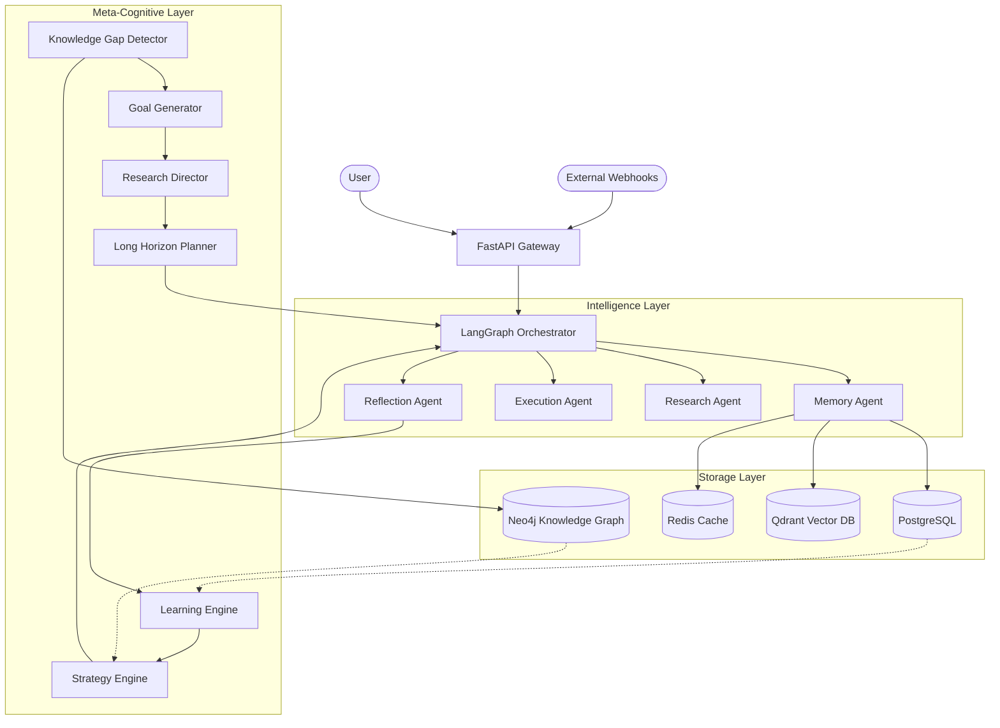

---

## SECTION 3: COMPLETE ARCHITECTURE

### 1. System Architecture
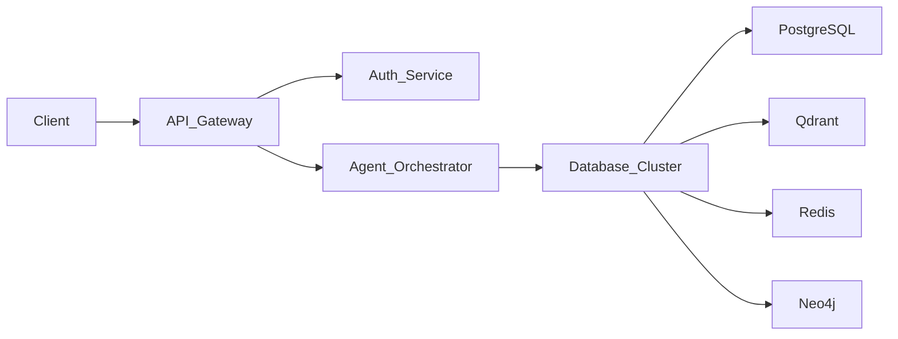

### 2. Agent Architecture
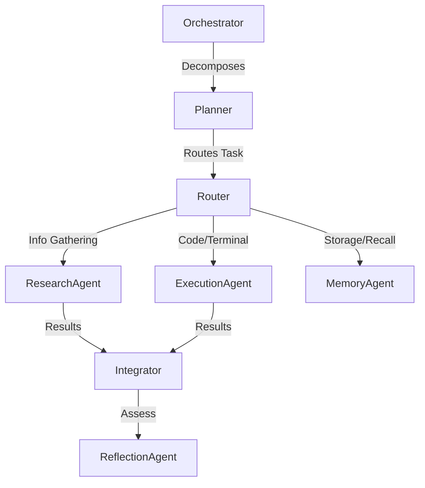

### 3. Memory Architecture
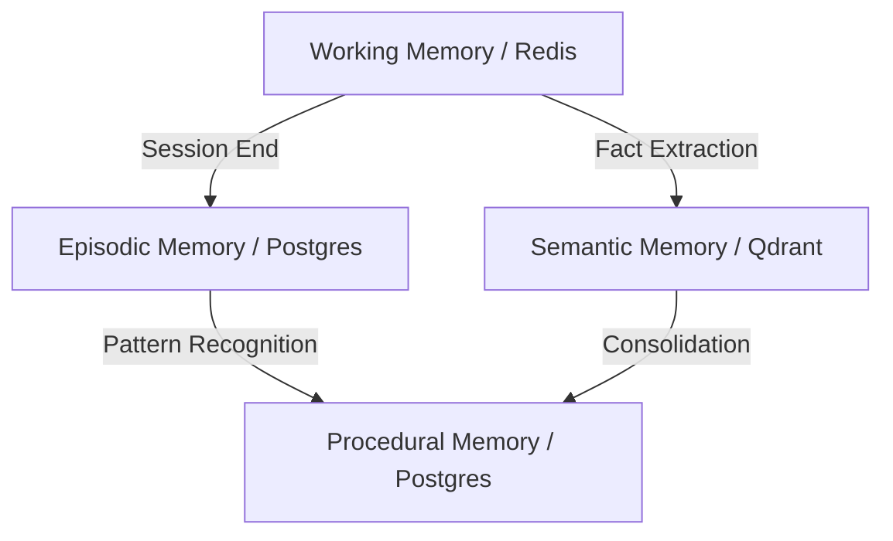

### 4. RAG Architecture
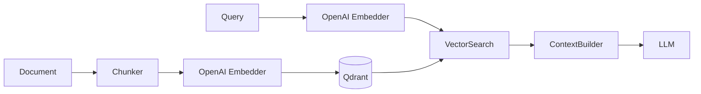

### 5. Knowledge Graph Architecture
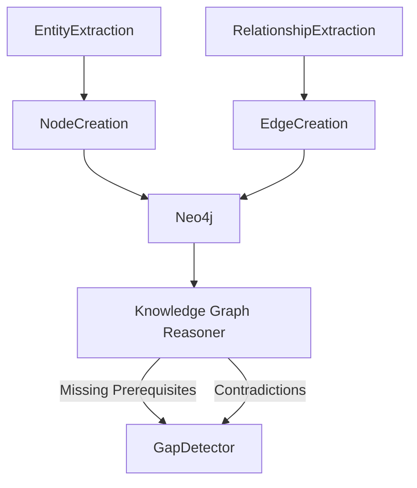

### 6. Learning Architecture
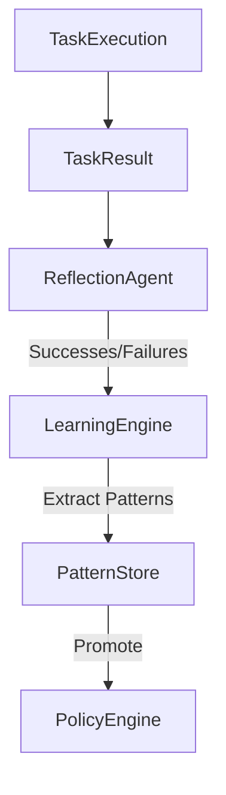

### 7. Meta-Learning Architecture
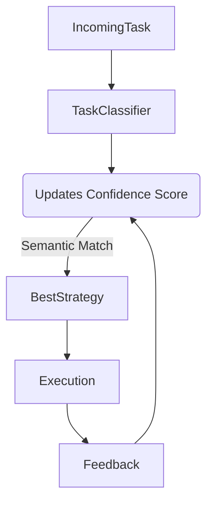

### 8. Autonomous Research Architecture
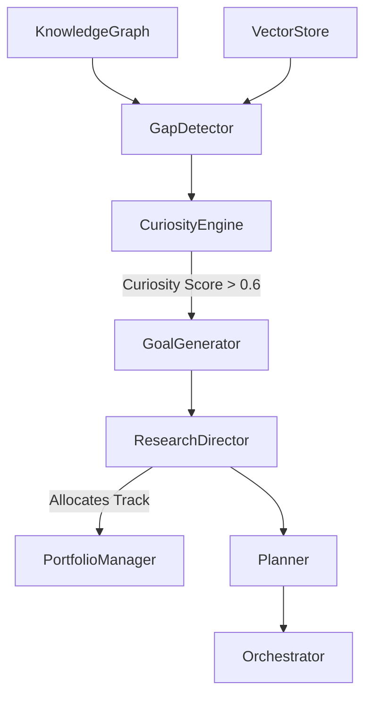

### 9. Infrastructure Architecture
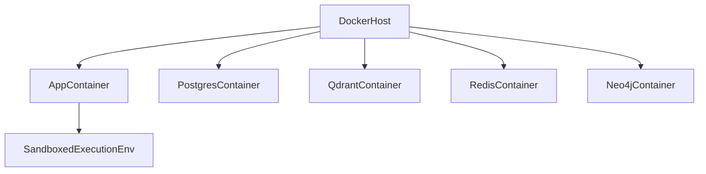

### 10. Deployment Architecture
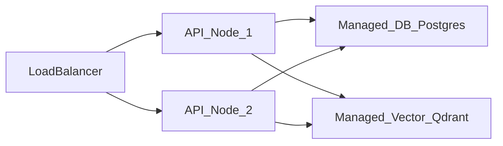

---

## SECTION 4: DIRECTORY STRUCTURE

The project is structured following Domain-Driven Design (DDD) principles and modern Python backend standards.

```text
ModelX/
├── alembic/                  # Database schema migrations
│   ├── env.py                # Alembic environment configuration
│   └── versions/             # Iterative SQL migration scripts
├── docs/                     # Project documentation (You are here)
├── src/                      # Core application source code
│   ├── agents/               # LangGraph agent definitions and states
│   │   ├── orchestrator.py   # Main LangGraph StateMachine
│   │   ├── state.py          # Shared AgentStateDict definition
│   │   ├── planner_v2.py     # Long-horizon 100+ step planner
│   │   ├── research_director.py # Autonomous track allocator
│   │   ├── goal_generator.py # Autonomous objective generator
│   │   └── autonomous_research_loop.py # Background autonomous loop
│   ├── api/                  # FastAPI web server layer
│   │   ├── dependencies.py   # FastAPI dependency injection (DB, Agents)
│   │   ├── main.py           # Application entry point and router mounting
│   │   ├── middleware.py     # CORS, Logging, Error handling
│   │   ├── routes/           # REST endpoint definitions by domain
│   │   └── schemas/          # Pydantic input/output validation models
│   ├── config/               # System configuration
│   │   ├── settings.py       # Pydantic BaseSettings (env vars)
│   │   └── logging.py        # Structured JSON logger setup
│   ├── db/                   # Relational database layer (PostgreSQL)
│   │   ├── database.py       # Async SQLAlchemy session management
│   │   ├── enums.py          # Postgres ENUM types
│   │   ├── models.py         # SQLAlchemy ORM declarations
│   │   └── repositories/     # Repository pattern data access classes
│   ├── knowledge_graph/      # Topological memory layer (Neo4j)
│   │   ├── client.py         # Async Neo4j driver wrapper
│   │   ├── manager.py        # Entity/Concept node insertion logic
│   │   └── reasoning.py      # Cypher queries for gap/contradiction detection
│   ├── memory/               # Episodic and working memory subsystems
│   │   └── long_term.py      # Persistence interfaces for memory
│   ├── meta/                 # Meta-learning and reflection subsystems
│   │   ├── curiosity_engine.py # Evaluates gaps to calculate scores
│   │   ├── experience_replay.py # Caches past execution traces
│   │   ├── goal_tree.py      # Hierarchical dependency tracking
│   │   ├── knowledge_gap_detector.py # Finds weak spots in system knowledge
│   │   ├── learning_engine.py # Abstracts lessons from reflections
│   │   ├── portfolio_manager.py # Manages high-level research tracks
│   │   ├── skill_library.py  # Repository of reusable procedural code
│   │   ├── strategy_engine.py # Ranks execution strategies
│   │   └── task_classifier.py # Categorizes tasks semantically
│   └── rag/                  # Semantic memory layer (Qdrant)
│       ├── vector_store.py   # Qdrant client wrapper and collection manager
│       └── document_parser.py # Text extraction and chunking
├── tests/                    # Test suite (pytest)
│   ├── unit/                 # Isolated component tests
│   ├── integration/          # Database and API integration tests
│   └── e2e/                  # End-to-end multi-agent flow tests
├── docker-compose.yml        # Local infrastructure orchestration
├── pyproject.toml            # Python dependencies and build config
└── README.md                 # Primary project entrypoint
```

### Directory Responsibilities
- **`src/agents/`**: Contains the core intelligence of the system. Relies heavily on LangChain and LangGraph.
- **`src/api/`**: Strictly handles HTTP transport, validation, and serialization. Does not contain business logic.
- **`src/db/`**: Handles all structured data persistence. Uses the Repository pattern to decouple ORMs from business logic.
- **`src/meta/`**: Houses all Phase 5 and Phase 6 cognitive upgrades that allow the system to self-optimize and explore autonomously.
