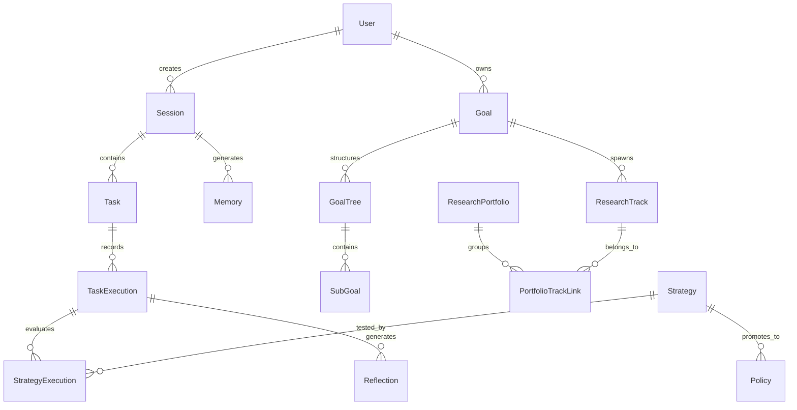

## SECTION 5: DATABASE DOCUMENTATION

ModelX relies heavily on PostgreSQL for structured relational data. The database schema is designed to track long-term execution histories, hierarchical goals, and meta-learning configurations.

### Entity-Relationship Diagram

### Table Definitions

#### 1. Users & Sessions
- **`users`**: Purpose: Identity tracking.
  - Columns: `id` (UUID, PK), `email` (String, Unique), `hashed_password` (String), `is_active` (Boolean).
- **`sessions`**: Purpose: Group tasks and agent interactions by time boundary.
  - Columns: `id` (UUID, PK), `user_id` (UUID, FK), `title` (String), `status` (Enum).

#### 2. Execution & History
- **`tasks`**: Purpose: Decomposed individual actions.
  - Columns: `id`, `session_id`, `description`, `agent_type`, `status`.
- **`task_executions`**: Purpose: Immutable ledger of execution attempts.
  - Columns: `id`, `task_id`, `output`, `error_message`, `tokens_used`, `duration_ms`.

#### 3. Meta-Learning
- **`strategies`**: Purpose: Reusable approaches for solving specific task types.
  - Columns: `id`, `name`, `description`, `task_type` (Enum), `confidence_score` (Float).
- **`strategy_executions`**: Purpose: Linking strategies to actual task attempts to track success rates.
  - Columns: `id`, `strategy_id`, `task_execution_id`, `success` (Boolean), `feedback` (String).
- **`policies`**: Purpose: Automated rules promoted from highly successful strategies.
  - Columns: `id`, `strategy_id`, `rule_definition` (JSON).
- **`skills`**: Purpose: Stored procedural code snippets.
  - Columns: `id`, `name`, `code_content`, `validation_status` (Enum).

#### 4. Autonomous Research
- **`knowledge_gaps`**: Purpose: Tracking areas where the system lacks information.
  - Columns: `id`, `domain`, `description`, `importance`, `confidence`.
- **`generated_goals`**: Purpose: Objectives autonomously derived from gaps.
  - Columns: `id`, `gap_id`, `title`, `curiosity_score`, `status`.
- **`goal_trees`** & **`sub_goals`**: Purpose: 100+ step hierarchical plans.
  - Columns: `tree_id`, `parent_id`, `dependencies` (Array).
- **`research_tracks`**: Purpose: Active continuous investigations.
  - Columns: `id`, `goal_id`, `progress_percentage`, `status`.
- **`research_portfolios`**: Purpose: Broad groupings of tracks.
  - Columns: `id`, `name`, `overall_progress`.

---

## SECTION 6: AGENT DOCUMENTATION

ModelX uses a multi-agent system where distinct personas handle different responsibilities. They are orchestrated by LangGraph.

### 1. OrchestratorAgent
- **Purpose**: The central nervous system of ModelX.
- **Responsibilities**: Analyzes user goals, decomposes them into tasks, routes tasks to specialists, evaluates integration of results, and triggers reflection loops.
- **Inputs**: User Prompt, AgentStateDict.
- **Outputs**: Fully populated AgentStateDict, Final Execution Report.
- **Workflow**: Goal Analysis -> Decompose Tasks -> Classify Task -> Route -> Integrate -> Replan -> Reflect.

### 2. ResearchAgent
- **Purpose**: Information gathering and synthesis.
- **Responsibilities**: Formulates search queries, interfaces with web APIs (e.g., Tavily), reads documentation, and synthesizes findings.
- **Inputs**: Task Description, Search APIs.
- **Outputs**: Structured Research Report.
- **Dependencies**: RAG Vector Store, External APIs.

### 3. ExecutionAgent
- **Purpose**: Performing actions that alter the world state.
- **Responsibilities**: Writes code, executes bash commands, modifies files, interacts with REST APIs.
- **Inputs**: Strategy context, Task instructions, Code environment.
- **Outputs**: Command outputs, Error traces.
- **Dependencies**: Docker Sandboxing.

### 4. MemoryAgent
- **Purpose**: Cognitive persistence.
- **Responsibilities**: Stores and recalls information from PostgreSQL (Episodic) and Qdrant (Semantic).
- **Inputs**: Context strings, User queries.
- **Outputs**: Retrieved MemoryRecords, KnowledgeChunks.

### 5. ReflectionAgent
- **Purpose**: Self-correction and evaluation.
- **Responsibilities**: Reviews a completed session, identifies what went right and wrong, and isolates root causes of failures.
- **Inputs**: Task Execution Traces.
- **Outputs**: ReflectionOutput (Successes, Failures, Root Causes).

### 6. StrategyAgent
- **Purpose**: Adaptive planning.
- **Responsibilities**: Suggests novel ways to approach a task if standard methods fail by synthesizing existing skills and baseline strategies.
- **Outputs**: Dynamic Strategy JSON.

### 7. SelfImprovementAgent
- **Purpose**: System-wide optimization.
- **Responsibilities**: Periodically reviews aggregate metrics (latency, token usage, success rates) and modifies internal system prompts and automated policies.
- **Workflow**: Runs asynchronously as a background cron job.

### 8. GoalGenerator
- **Purpose**: Proactive objective setting.
- **Responsibilities**: Reviews Knowledge Gaps identified by the system and uses LLMs to generate actionable goals to close those gaps.
- **Inputs**: KnowledgeGap, CuriosityScore.
- **Outputs**: GeneratedGoal record.

### 9. ResearchDirector
- **Purpose**: Investigation management.
- **Responsibilities**: Evaluates generated goals. If the curiosity score passes the threshold, it allocates a new `ResearchTrack` and initiates planning.
- **Dependencies**: GoalGenerator, LongHorizonPlanner.

### 10. PortfolioManager
- **Purpose**: High-level organization.
- **Responsibilities**: Groups multiple Research Tracks into cohesive domains (e.g., "Memory Architecture Optimization") and tracks aggregate progress.
