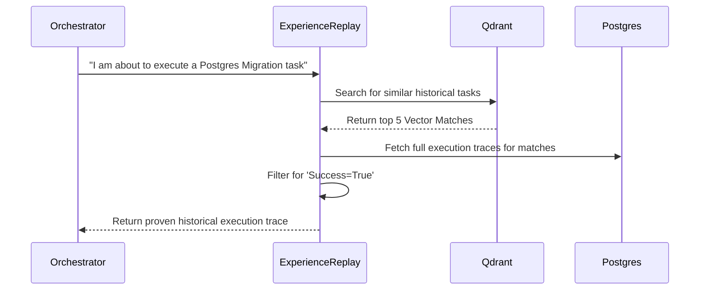
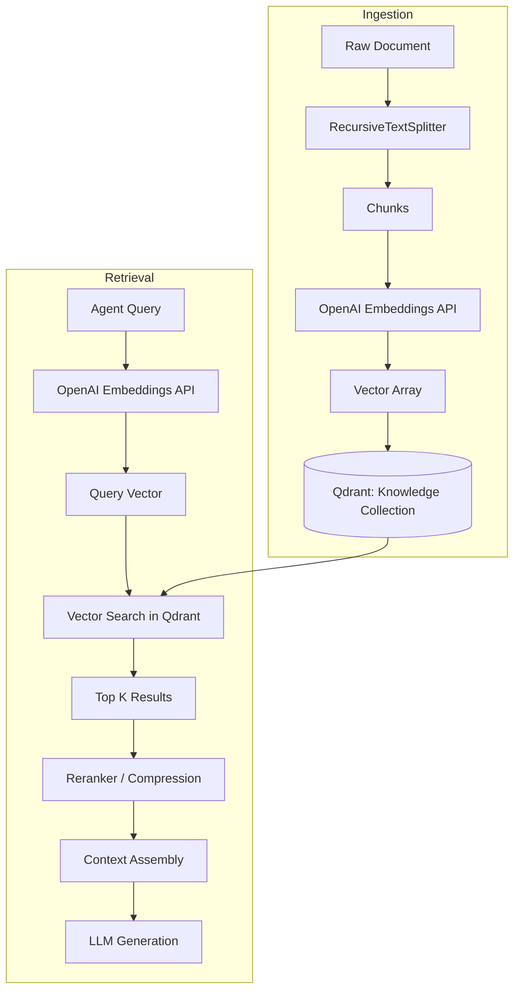

## SECTION 7: MEMORY SYSTEM DOCUMENTATION

ModelX features a multi-tiered memory architecture inspired by human cognition. Rather than treating memory as a simple database query, the system shifts information across layers based on relevance, decay, and reinforcement.

### Memory Tiers

#### 1. Short-Term Memory (Redis)
- **Concept**: Represents the "Working Memory" or context window of an active session.
- **Function**: Temporarily holds variable states, recent agent messages, and intermediate calculation results.
- **Eviction**: Cleared or persisted when a session terminates.

#### 2. Episodic Memory (PostgreSQL)
- **Concept**: Autobiographical ledger of events.
- **Function**: Stores a chronological history of what the agent did. Maps `Task` -> `TaskExecution` -> `Outputs`.
- **Use Case**: Post-execution reflection and debugging. "What did I do last Tuesday when trying to deploy the web app?"

#### 3. Semantic Memory (Qdrant)
- **Concept**: Abstracted, general knowledge separated from the time it was learned.
- **Function**: Embeds documents, facts, and abstracted rules into vectors for fast semantic similarity search.

#### 4. Procedural Memory (PostgreSQL/Meta-Layer)
- **Concept**: Memory of *how* to do things.
- **Function**: Consists of `Strategies`, `Policies`, and executable `Skills`. Triggered implicitly based on task classification rather than explicit factual lookup.

### Memory Workflows

#### Experience Replay Workflow

#### Memory Consolidation
The `MemoryConsolidator` periodically scans raw Episodic Memories. If it detects multiple memories about "Docker build failures", it uses an LLM to abstract a single generalized rule: "Always ensure multi-stage Dockerfiles copy the compiled binary to the final scratch image." This rule is then embedded into Semantic Memory, and the raw episodic traces can be compressed.

---

## SECTION 8: RAG DOCUMENTATION

Retrieval-Augmented Generation (RAG) forms the basis of the system's external knowledge ingestion and retrieval process.

### Components

1. **Document Ingestion API**: Endpoint to upload raw files (PDF, Markdown, HTML, source code).
2. **Chunking Engine**: Uses recursive character text splitters to divide documents into semantically coherent overlapping chunks (typically 1000 tokens with 200 overlap).
3. **Embedder**: Interfaces with `text-embedding-3-large` via the OpenAI API to convert chunks into 3072-dimensional floating-point vectors.
4. **VectorDB (Qdrant)**: Stores vectors and metadata (source URI, timestamps, domain tags).

### RAG Workflow

### Advanced RAG Techniques Used
- **Metadata Filtering**: Searches can be restricted to specific domains (e.g., `domain: 'python_dev'`) to increase precision.
- **Context Compression**: The raw top-K results are passed through a secondary LLM filter to extract only the sentences strictly relevant to the query before injecting them into the main agent's prompt, saving context window space.
