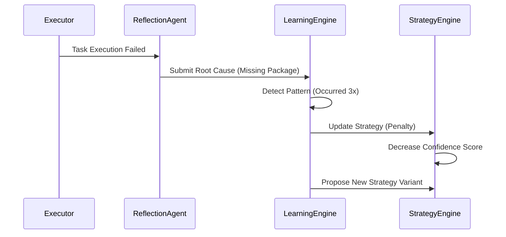
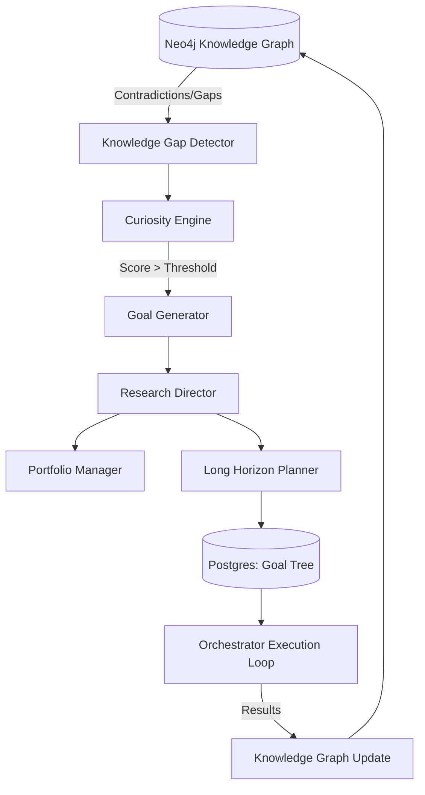
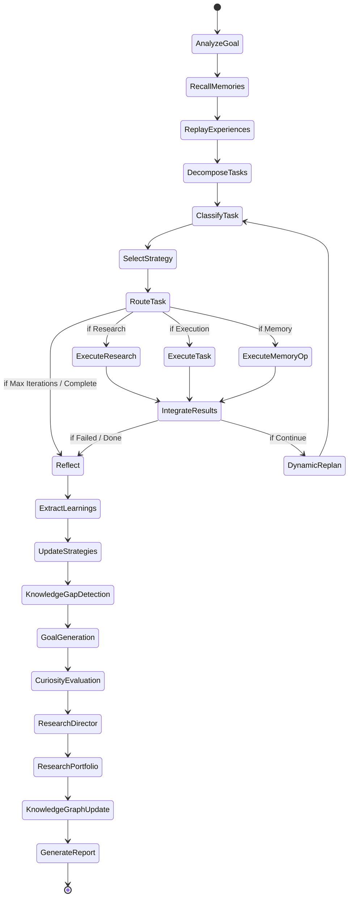

## SECTION 9: META-LEARNING DOCUMENTATION

The Meta-Learning subsystem transforms ModelX from a static pipeline into an adaptive cognitive architecture. It observes the agent's successes and failures and updates the operational parameters of the system over time.

### Key Components

#### Reflection
After every task execution sequence, the `ReflectionAgent` evaluates the traces. It compares the initial `Goal` against the actual `Outputs` and generates a structured critique identifying root causes of failure (e.g., "Dependency missing", "Syntax error", "Hallucinated API endpoint").

#### Learning Engine
Ingests reflections. If a root cause appears repeatedly (e.g., 3 failures due to missing environment variables), the `LearningEngine` abstracts this into a `LearningPattern`. 

#### Strategy Engine
When a task is classified by the `TaskClassifier` (e.g., as `code_refactor`), the `StrategyEngine` queries the database for `Strategies` tied to that task type. It ranks them by `confidence_score` (calculated as successful executions / total executions). The Orchestrator applies the highest-ranked strategy. If it fails, the score decreases. Over time, poor strategies fall out of rotation.

### Meta-Learning Workflow

---

## SECTION 10: AUTONOMOUS RESEARCH SYSTEM

This system allows ModelX to proactively construct its own goals without user input, effectively allowing it to research, code, and learn indefinitely in the background.

### Mechanisms

1. **Knowledge Gap Detection**: The `KnowledgeGraphReasoner` periodically queries Neo4j for nodes with a `CONTRADICTS` relationship, or nodes marked as `REQUIRES` but missing in the database.
2. **Curiosity Engine**: Evaluates the detected gaps using a heuristic: `Score = (Novelty + Uncertainty + Impact + Importance) / 4`. 
3. **Goal Generation**: Gaps with a Curiosity Score > 0.6 are passed to the `GoalGenerator` LLM to formulate an actionable research objective.
4. **Research Director**: Groups generated goals into long-term `ResearchPortfolios` and initializes a `ResearchTrack`.
5. **Long Horizon Planner**: Decomposes the high-level goal into a hierarchical tree of up to 100+ deterministic subgoals (`GoalTree`).

### Autonomous Workflow

---

## SECTION 11: LANGGRAPH STATE MACHINE

LangGraph enforces deterministic control flow over the LLM agents. The `AgentStateDict` is passed sequentially from node to node.

### Complete StateGraph Flow

### State Management
The graph relies on the `AgentStateDict`, a `TypedDict` containing all transient state:
- `task_plan`: List of tasks to execute.
- `current_task_index`: Pointer to current task.
- `task_results`: Dictionary accumulating outputs.
- `errors`: List of failures.
- `iteration_count`: Incremented per loop to prevent infinite loops (hard stop at `max_iterations`).
