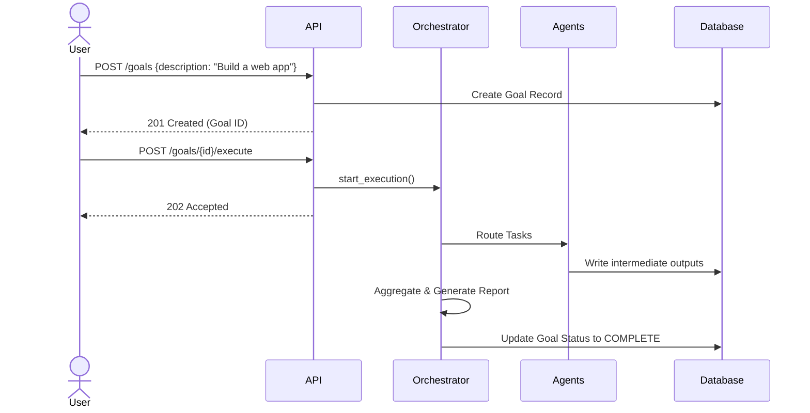
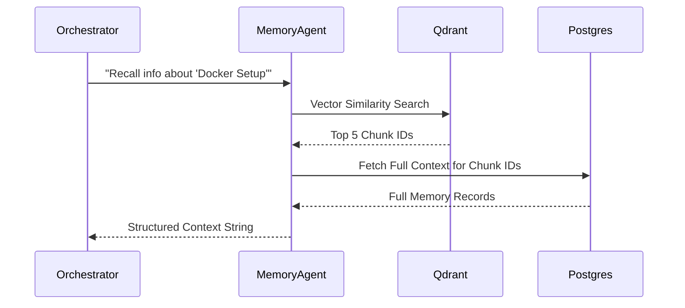
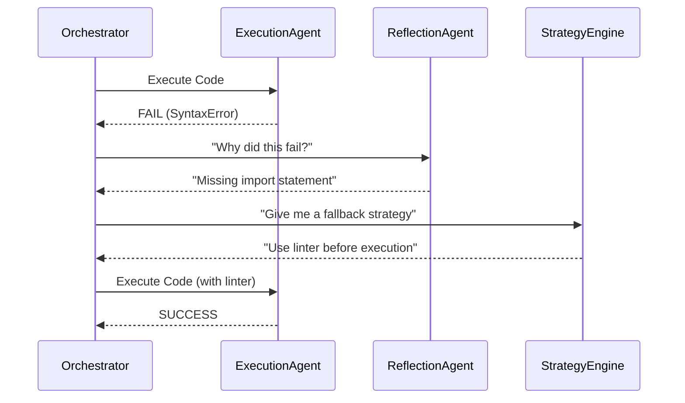

## SECTION 12: API DOCUMENTATION

ModelX provides a RESTful API powered by FastAPI.

### Authentication
All protected endpoints require a Bearer token in the `Authorization` header (`Authorization: Bearer <token>`). Tokens are JWTs signed with `HS256`.

### Core Endpoints

#### 1. Goals API (`/api/v1/goals`)

| Method | Endpoint | Description | Request | Response | Status Codes |
|---|---|---|---|---|---|
| POST | `/` | Submit a new user goal | `{"title": "...", "description": "..."}` | `GoalResponse` | 201 Created, 400 Bad Request |
| GET | `/{goal_id}` | Get goal status | None | `GoalResponse` | 200 OK, 404 Not Found |
| POST | `/{goal_id}/execute` | Trigger Orchestrator | `{"max_iterations": 20}` | `ExecutionResult` | 202 Accepted |

#### 2. Tasks API (`/api/v1/tasks`)

| Method | Endpoint | Description | Request | Response | Status Codes |
|---|---|---|---|---|---|
| GET | `/{task_id}` | Retrieve specific task detail | None | `TaskResponse` | 200 OK |
| PATCH | `/{task_id}/status`| Update task status | `{"status": "completed"}` | `TaskResponse` | 200 OK |

#### 3. Memory API (`/api/v1/memory`)

| Method | Endpoint | Description | Request | Response | Status Codes |
|---|---|---|---|---|---|
| POST | `/store` | Store an episodic memory | `{"content": "...", "type": "episodic"}` | `MemoryResponse` | 201 Created |
| GET | `/recall` | Search memory (RAG) | `?q=query&limit=5` | `list[MemoryResponse]` | 200 OK |

#### 4. Meta-Learning API (`/api/v1/meta`)

| Method | Endpoint | Description | Request | Response | Status Codes |
|---|---|---|---|---|---|
| GET | `/strategies` | List execution strategies | `?task_type=coding` | `list[StrategyResponse]` | 200 OK |
| GET | `/skills` | List stored procedural skills | None | `list[SkillResponse]` | 200 OK |

#### 5. Autonomous Research API (`/api/v1/autonomous`)

| Method | Endpoint | Description | Request | Response | Status Codes |
|---|---|---|---|---|---|
| GET | `/gaps` | List detected knowledge gaps | None | `list[KnowledgeGapResponse]` | 200 OK |
| POST | `/goals/generate` | Trigger autonomous generation | `{"limit": 5}` | `{"message": "..."}` | 202 Accepted |
| GET | `/portfolios` | View active research portfolios | None | `list[PortfolioResponse]` | 200 OK |

---

## SECTION 13: WORKFLOW DOCUMENTATION

### Workflow 1: User Goal Execution

### Workflow 2: Memory Recall

### Workflow 3: Failure Recovery (Self-Healing)

