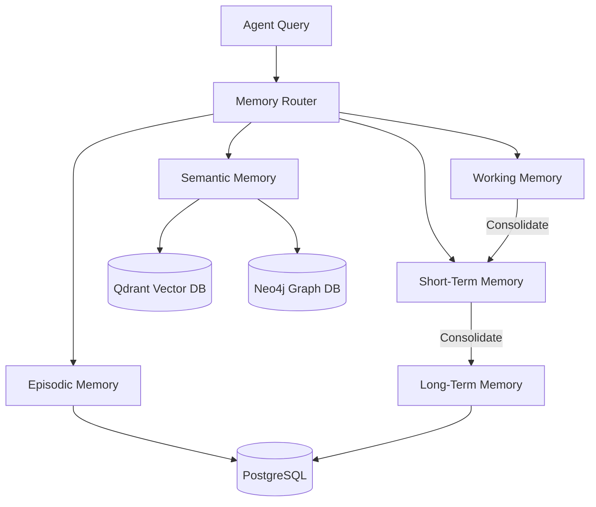

# 5. Memory System Architecture

The memory system is one of the most sophisticated components of ModelX, implementing a biological-inspired multi-tiered architecture (Memory Fabric).

## Memory Tiers

1. **Working Memory (`working_memory.py`)**
   - **Purpose:** Immediate, volatile context for the current reasoning step.
   - **Storage:** In-memory (Redis / Process RAM).
   - **Mechanism:** Strict token-limit enforcement (e.g., sliding window).

2. **Short-Term Memory (`short_term.py`)**
   - **Purpose:** Context spanning the current session or task lifecycle.
   - **Storage:** Redis + PostgreSQL.
   - **Mechanism:** Consolidates working memory episodes into broader task-level contexts.

3. **Long-Term Memory (`long_term.py`)**
   - **Purpose:** Persistent facts, user preferences, and core knowledge.
   - **Storage:** PostgreSQL.
   - **Mechanism:** Requires explicit "commit" or "consolidation" steps (`memory_consolidation.py`) to move data from short-term to long-term.

4. **Semantic Memory (`semantic_memory.py`)**
   - **Purpose:** Meaning-based retrieval of concepts and facts.
   - **Storage:** Qdrant (Vector Embeddings) & Neo4j (Graph relationships).
   - **Mechanism:** Information is vectorized and placed in a semantic space.

5. **Episodic Memory (`episodic_memory.py`)**
   - **Purpose:** Timeline-based records of past events and agent actions.
   - **Storage:** PostgreSQL (Time-series structured data).
   - **Mechanism:** Allows the agent to "remember" what it did yesterday and the outcome of that action.

## Memory Fabric (`memory_fabric.py`)
The `MemoryFabric` and `MemoryRouter` orchestrate the flow between these tiers. When an agent queries for context, the router determines whether the answer lies in semantic space (Qdrant), episodic history (Postgres), or immediate working memory.

### Diagram: Memory Flow

