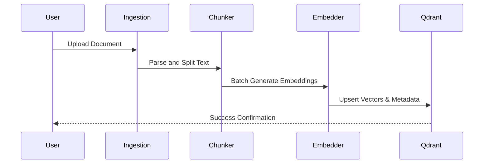
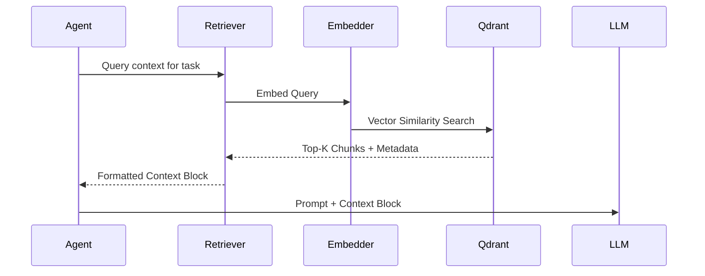

# 6. RAG Architecture Report

The Retrieval-Augmented Generation (RAG) pipeline is a core feature of ModelX, designed to grounding agent responses in factual data.

## RAG Pipeline Components

The pipeline (located in `src/rag/`) consists of:
1. **Ingestion (`ingestion.py`)**: Handles the loading of raw data (PDFs, text, web pages).
2. **Chunking (`chunking.py`)**: Implements strategies for splitting documents. It likely includes semantic chunking, recursive character splitting, and token-aware splitting (via `tiktoken`).
3. **Embeddings (`embeddings.py`)**: Interfaces with providers (OpenAI, DeepSeek, etc.) to convert text chunks into high-dimensional vectors (e.g., 1536 dimensions for OpenAI).
4. **Vector Store (`vector_store.py`)**: A wrapper around the Qdrant client, managing collections, indexing, and similarity search.
5. **Retriever (`retriever.py`)**: Implements retrieval strategies, likely including standard semantic search, hybrid search (keyword + semantic), and reranking.

## Document Ingestion Workflow

## Retrieval Workflow

